# Автоматизированное рабочее место врача от Leybasoft™ версия 4

Добро пожаловать на страницу справки программы **"АРМ врача" от Leybasoft™ версия 4**. Здесь вы найдете сведения по основным разделам программы.

> ПРОГРАММА ПРЕДОСТАВЛЯЕТСЯ AS IS (КАК ЕСТЬ), ОНА НЕ ОБЛАДАЕТ СВОЙСТВАМИ ИСКУССТВЕННОГО ИНТЕЛЛЕКТА (AI), НЕ ПЕРЕДАЕТ СВЕДЕНИЯ ТРЕТЬИМ ЛИЦАМ БЕЗ ВАШЕГО УЧАСТИЯ, ЯВЛЯЯСЬ ПО СУТИ ПРОДВИНУТОЙ "ЗАПИСНОЙ КНИЖКОЙ". ЭТО ОЗНАЧАЕТ, ЧТО ЗА ПОВРЕЖДЕНИЕ ИЛИ УТЕЧКУ ВАШИХ ДАННЫХ ОТВЕТСТВЕННОСТЬ НЕСЕТ КТО УГОДНО, ТОЛЬКО НЕ АВТОР ПРОГРАММЫ. ЕСЛИ ВЫ НЕ СОГЛАСНЫ С ЭТИМ УТВЕРЖДЕНИЕМ, ВЫ НЕ ДОЛЖНЫ ИСПОЛЬЗОВАТЬ ЭТУ ПРОГРАММУ.


## ОГЛАВЛЕНИЕ <a name="page_toc"></a>

[1. Установка и конфигурирование сервера Firebird](#01_server_install)
- [Использование инсталлятора](#01_download_installator)
- [Использование zip-архива](#01_download_zip) 
- [Запуск/остановка сервера](#server_run_stop) [TODO]
- [Задание пароля для администратора БД "вручную"](#01_setup_password)
- [Отличия полноценной и embedded архитектур сервера](#server_archicture)

[2. Меню "База данных"](#2_mnu_db)
- [Создать базу данных](#21_mnu_create_db) 
- [Подключиться к базе данных](#22_mnu_connect_db) 
- [Отсоединиться от базы данных](#23_mnu_disconnect_db)
- [Обновить данные](#24_mnu_refresh_db) 
- [Выход из программы](#25_mnu_exit_app)

[3. Меню "Пациент"](#3_mnu_db)
- [Добавить пациента](#31_mnu_patient_add) 
- [Редактировать данные пациента](#32_mnu_patient_edit) 
- [Удалить пациента](#33_mnu_patient_del)
- [Визиты к врачу](#34_mnu_patient_visit_list)
- [Добавить новый визит](#35_mnu_patient_visit_add)
- [Редактировать данные визита](#36_mnu_patient_visit_edit)
- [Удалить данные визита из базы](#37_mnu_patient_visit_del)
- [Окно работы с данными визита](#38_mnu_patient_visit_window)
	- [Вкладка "Жалобы пациента"](#381_mnu_patient_visit_complaints)
	- [Вкладка "Анамнез заболевания"](#382_mnu_patient_visit_anamnesis)
	- [Вкладка "Общий осмотр"](#383_mnu_patient_visit_praesens)
		- [Status praesens](#3831_mnu_patient_visit_st_praesens)
		- [Status localis](#3832_mnu_patient_visit_st_localis)
		- [Осмотр per rectum (для мужчин)](#3833_mnu_patient_visit_perrectum)
		- [Осмотр per vaginum (для женщин)](#3834_mnu_patient_visit_pervaginum)	
	- [Вкладка "Лабораторные исследования"](#384_mnu_patient_visit_labor)
		- [Общеклинические исследования](#3841_mnu_patient_visit_labor_common)
		- [Специальные исследования](#3842_mnu_patient_visit_labor_special)
		- [Бактериальные посевы](#3843_mnu_patient_visit_labor_bact)	
	- [Вкладка "Инструментальные исследования"](#385_mnu_patient_visit_instrumental)
		- [УЗИ почек и мочевого пузыря](#3851_mnu_patient_visit_instr_UZI_ren)
		- [УЗИ гениталий и простаты](#3852_mnu_patient_visit_instr_UZI_genit)
		- ["Сухая" передняя уретроскопия](#3853_mnu_patient_visit_instr_dry_scope)
		- [Ирригационная уретроскопия](#3854_mnu_patient_visit_instr_irrig_scope)	
	- [Вкладка "Диагноз и лечение"](#386_mnu_patient_visit_treatment) 
		- [Медикаментозное лечение](#3861_mnu_patient_visit_treatment_treat)
		- [Диагноз](#3862_mnu_patient_visit_treatment_ds)
		- [Местные манипуляции](#3863_mnu_patient_visit_treatment_manip)
		- [Рекомендации](#3864_mnu_patient_visit_treatment_recom)	
- [Общий список пациентов](#39_mnu_patient_total_list)
- [Платежи](#3310_mnu_patient_payments)
- [Заметки](#3311_mnu_patient_notes)
- [Поиск пациента](#3312_mnu_patient_find)

[4. Меню "Справочники"](#4_mnu_db)
- [Населенные пункты](#41_mnu_cities)
- [Врачи](#42_mnu_medical)
- [Лечебные учреждения](#43_mnu_hospital)
- [Расписание приема врача](#44_mnu_shedul)
- [Прайс-лист](#45_mnu_price)
	- [Создание прайс-листа "с нуля"](#451_mnu_price_create_empty)
	- [Создание прайс-листа из уже имеющихся прайсов](#452_mnu_price_create_exists)
	- [Редактирование текущего прайса](#453_mnu_price_create_edit)
	- [Удаление текущего прайса](#454_mnu_price_create_delete)
- [Разделы базового прайса](#46_mnu_price_depart)
- [Список услуг базового прайса](#47_mnu_price_list)
- [Справочник лекарств](#48_mnu_drug_list)
- [Справочник диагнозов](#49_mnu_ds_list)
- [Список манипуляций](#410_mnu_manip_list)
- [Список рекомендаций](#411_mnu_recom_list)

[5. Меню "Отчеты"](#5_mnu_db_report)
- [Общий осмотр](#51_mnu_db_report_exam)
	- [Общий осмотр(формат А5) полный](#511_mnu_db_report_exam_only_a5)
	- [Общий осмотр(формат А5) краткий](#512_mnu_db_report_exam_short_a5)
	- [Общий осмотр(формат А5) с анализами](#513_mnu_db_report_exam_full_a5)
	- [Общий осмотр(формат А4) полный](#514_mnu_db_report_exam_only_a4)
	- [Общий осмотр(формат А4) краткий](#515_mnu_db_report_exam_short_a4)
	- [Общий осмотр(формат А4) с анализами](#516_mnu_db_report_exam_full_a4)
- [Фото с приема](#52_mnu_db_report_photos)
- [Ультразвуковые исследования](#53_mnu_db_report_US)
- [Бланк обследования на сифилис](#54_mnu_db_report_lues)
- [Направления на исследования](#55_mnu_db_report_research)
- [Титульный лист амбулаторной карты](#56_mnu_db_report_titul)
- [Расписание приема врача](#57_mnu_db_report_shedul)
- [Подготовка к исследованиям](#58_mnu_db_report_prepare)

[6. Меню "Помощь"](#6_mnu_db_help)
- [Справка](#61_mnu_db_helpfile)
- [Настройки](#62_mnu_db_preferences)
- [О программе](#63_mnu_db_about)

[7. Контекстные меню](#7_mnu_db_popup)
- [Меню общего списка пациентов](#71_mnu_db_popup_main)
- [Меню списка визитов пациента](#72_mnu_db_popup_detail)
- [Меню иконки приложения](#73_mnu_db_popup_tray)

[8. Окно редактора текста](#8_mnu_db_editor)

---

### Немного о сервере Firebird, портах и прочих премудростях простыми словами

Сервер базы данных - это специальная программа, которая позволяет пользовательскому приложению обращаться к базе данных (БД), получать/сохранять данные, следит за корректной целостностью данных. Проще говоря, это программа-посредник между пользователем и БД. Пользовательские программы могут "заставить" работать Firebird в режиме полноценного сервера или embedded-режиме (различия описаны в этом разделе ниже).  

Прежде, чем пользователь сможет работать с базой данных, ему сначала необходимо установить и запустить сервер.

### 1.Установка сервера <a name="01_server_install"></a>
Сервер на PC можно установить двумя способами:

#### Использование [инсталлятора](https://github.com/FirebirdSQL/firebird/releases/download/v3.0.11/Firebird-3.0.11.33703_0_Win32.exe) <a name="01_download_installator"></a>

Этот способ подходит для тех, кто имеет права администратора на своем рабочем месте и хочет/может его установить. 


> <u>Из преимуществ:</u> все настройки сервера производит сам инсталлятор.
>
> <u>Из недостатков:</u> этот способ установки вам не подойдет, если в системе уже установлен и запущен другой экземпляра сервера Firebird.

	
Запускаем инсталлятор и последовательно проходим все этапы
	

	

	

	

	

	

	
Все галочки оставляем по умолчанию
	
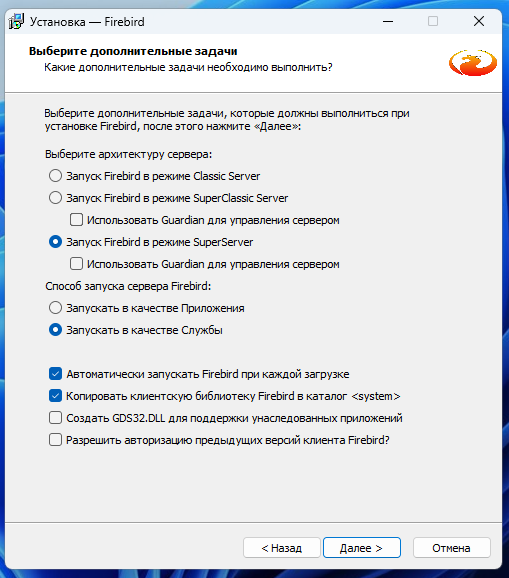
	
Здесь можно задать ***свой*** пароль администратора сервера (если оставите поля пустыми, то пароль администратора по умолчанию будет `masterkey`)


> <u>Обратите внимание:</u> пароль является *регистрочувствительным* (`masterkey` не эквивалентен `MasterKey`). В пароле предпочтительно использовать латиницу, но если совсем неймется, то *кириллический* пароль надо обязательно заключать в кавычки (например, так "ВасяПупкин")
	
	

	

	

	

	

	
	
Если вы оставили отмеченным пункт "Запустить службу Firebird", то служба сервера немедленно запустится, в чем можно убедиться, запустив диспетчер задач
	
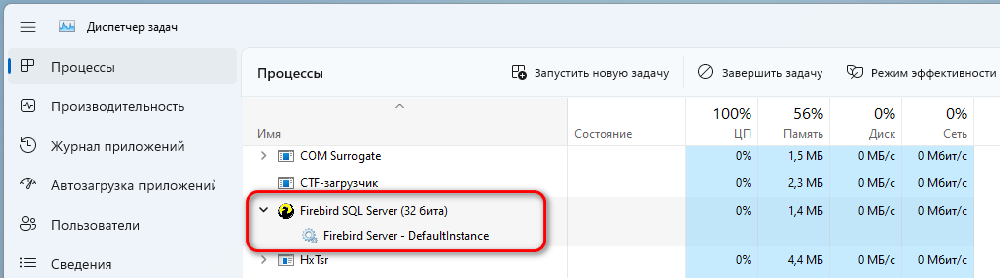
	
Наш сервер готов к работе. Он будет автоматически запускаться в виде *службы*(сервиса) при загрузке системы и использовать по умолчанию порт `3050`.
	
[Вернуться к оглавлению](#page_toc)	

---
   
#### Использование [zip-архива](https://github.com/FirebirdSQL/firebird/releases/download/v3.0.11/Firebird-3.0.11.33703-0_Win32.zip) <a name="01_download_zip"></a>

Этот способ предпочтителен для тех, кто: 
- не имеет прав доступа для установки стороннего ПО на свой PC
- работает на PC, где уже установлена другая версия сервера Firebird (например, вам требуется FB3, а у вас установлен и запущен FB2 или FB4 и т.д.)
- все ПО (включая сервер и БД) у вас расположено на флешке, которую вы носите с собой, чтобы не "оставлять следов" на рабочем PC

> <u>Из преимуществ:</u> позволяет запускать практически неограниченное количество экземпляров сервера Firebird в разных конфигурациях, не мешая работать уже имеющимся
>
><u>Из недостатков:</u> требует самостоятельно задавать пароль для администратора базы данных через командную строку (подробнее об этом написано [в этом разделе](#01_setup_password))
	
Распаковываем содержимое архива в какую-нибудь папку, например в `c:\portable\firebird_3_0_11_x32\`. Затем, открываем  терминал Windows и переходим в папку с сервером
```bash
cd c:\portable\firebird_3_0_11_x32\
```
Затем запускаем сервер Firebird *как приложение*<a name="01_run_server_app_wo_port"></a>

```bash
.\firebird.exe -a
```

> <u>Обратите внимание:</u> на версии Windows 10 и ниже запуск исполняемого файла в терминале вызывается просто как `firebird.exe -a`. На Windows 11 вызов исполняемого файла сделали "линуксоподобным", и корректным будет вызов `.\firebird.exe -a`
	

   
> <u>Обратите внимание:</u> на предыдущем скрине сервер вызывается как приложение и использует "умолчательный" порт `3050`. Если нужно использовать произвольный порт для "общения" приложения с сервером (например, `3052`), то строка запуска будет выглядеть как `.\firebird.exe -a -p 3052` <a name="01_run_server_app_wia_port"></a>

После запуска сервера в виде приложения появится запрос файрволла ОСи на разрешение работать серверу по протоколу TCP/IP через заданный порт


Соглашаемся, после чего в системном трее появится соответствующий значок


> <u>Обратите внимание:</u> чтобы при каждой загрузке ОСи не запускать сервер посредством командной строки, достаточно создать командный файл и вызывать запуск оттуда.

Откройте текстовый редактор и введите следующий текст

```bash
@echo off
start /wait c:\portable\firebird_3_0_11_x32\firebird.exe -a
pause
```


Затем сохраните файл с расширением **cmd**, например `run_fb_app.cmd`. Теперь запуск на исполнение этого файла вызовет запуск сервера в виде приложения, "слушающего" порт `3050`. 

> <u>Обратите внимание:</u> при использовании сервера из распакованного архива пароль для администратора базы данных вам ***необходимо задать самостоятельно!*** Без этого вы не сможете законнектиться к базе данных. Как это сделать, описано в [этом разделе](#01_setup_password).

[Вернуться к оглавлению](#page_toc)

---

#### Запуск/остановка сервера <a name="server_run_stop"></a>

... раздел в процессе разработки...

[Вернуться к оглавлению](#page_toc)

---

#### Задание пароля для администратора БД "вручную" <a name="01_setup_password"></a>

Задать/изменить пароль для любого пользователя можно через командную строку терминала. Процесс "телодвижений" сводится к следующему:
- запускается специальная утилита `isql.exe` из стандартной поставки сервера
- в специальном (embedded) режиме, где не проверяется пароль (по факту вводится "фейковый"), производится коннект к любой базе данных (обычно к идущим в поставке сервера демо-БД)
- специальными командами производится смена пароля на желаемый и сохраняются изменения
- завершается работа `isql.exe`

После этого можно производить коннект к БД из приложения "АРМ врача 4.5".

Итак, как это выглядит на практике (возьмем ситуацию, когда пароль для администратора SYSDBA не задан, например после распаковки архива):
- переходим в каталог сервера
```bash
cd c:\portable\firebird_3_0_11_x32\
```
- запускаем утилиту `isql.exe`
```bash 
.\isql
```

в терминале видим строку-приглашение с подсказкой от утилиты

```sql
Use CONNECT or CREATE DATABASE to specify a database
SQL>
```
Вводим следующую команду (так мы коннектимся к демо-базе в специальном ["embedded"-режиме](#server_archicture), в котором сервер не проверяет пароль, т.е. можно ввести любой пароль "от балды" :stuck_out_tongue_winking_eye:). При удачном коннекте сервер покажет к какой базе мы законнектились и под каким юзером

```sql
SQL> connect employee user sysdba password '1';
Database: employee, User: SYSDBA
```
Теперь задаем/меняем пароль для пользователя sysdba/SYSDBA(если имя пользователя задано латиницей и не в кавычках, то регистр символов не имеет значение). Изменения обязательно надо зафиксировать командой `commit`. Завершаем работу работу с утилитой `isql.exe` командой `quit`.

```sql
SQL> create or alter user sysdba password 'masterkey';
SQL> commit;
SQL> quit;
```

В окне терминала у нас должно быть примерно так


Особо пытливые, чтобы проверить "работоспособность" заданного пароля, могут вновь запустить утилиту `isql` выше описанным способом и в строке-приглашении законнектиться к базе в режиме ["полноценного" сервера](#server_archicture) по протоколу TCP/IP 

```sql
SQL> connect '127.0.0.1/31164:employee' user sysdba password 'masterkey';
Database: '127.0.0.1/31164:employee', User: SYSDBA
```


[Вернуться к оглавлению](#page_toc)

---

#### Отличия полноценной и embedded архитектур сервера <a name="server_archicture"></a>

Это раздел предназначен для особо любознательных пользователей :smiling_imp:

Кратко основное отличие архитектур сервера друг от друга заключается в следующем:
	
|**полноценный сервер**|**embedded-сервер** (или "встроенный")|
|:---|:---|
|количество одновременных коннектов <u>более одного</u>|количество одновременных коннектов <u>не более одного</u>|
|ввод пароля обязателен, пароль <u>должен соответствовать</u> имени пользователя|ввод пароля обязателен, но пароль <u>может быть произвольным</u>|
|в строке коннекта обязательно должен быть указан протокол, по которому происходит коннект (xNet, TCP/IP, NetBEUI, INet, INet4, INet6, WNet) и номер порта, если он отличается от "стандартного" 3050|протокол коннекта и номер порта не указываются|
|пользовательское приложение может быть расположено в любой отдельной папке|пользовательское приложение должно находится <u>в одной папке</u> с исполняемым файлом сервера `firebird.exe`|

[Вернуться к оглавлению](#page_toc)

---

## 1. Меню "База данных" <a name="2_mnu_db"></a>

### Cоздать <a name="21_mnu_create_db"></a>

... раздел в процессе разработки...

[Вернуться к оглавлению](#page_toc)

---

### Подключиться <a name="22_mnu_connect_db"></a>

Позволяет осуществить подключение к имеющейся базе данных из пункта меню


из панели инструментов


или при помощи "горячей	клавиши" `F3`

После вызова пункта меню открывается форма коннекта к базе данных приложения


1. **Порт приложения**

	Строка, где указывается [порт](https://thecode.media/port/) коннекта, который задается при конфигурации сервера. 

	Сервер Firebird по умолчанию устанавливает порт `3050`. Если сервер устанавливался из [штатного инсталлятора](#01_download_installator) или вы запустили сервер [как приложение](#01_run_server_app_wo_port), не указав номер порта, то порту сервера задан номер `3050`. Можно смело вводить эту цифру в поле ввода или отметить галочку "Стандартный порт".
	
	Если же порт сервера имеет другую величину (например, кто-то уже сконфигурировал настройки или вы запустили сервер как [приложение с указанием порта](#01_run_server_app_wia_port)), то вам необходимо указать соответствующий порт.
	
2. **Имя (IP адрес) сервера** 

	Поскольку программа "АРМ врача" от Leybasoft™ v.4.5 использует для коннекта протокол TCP/IP, вам необходимо указать имя сервера (задается в файле `<имя диска>:\Windows\System32\drivers\etc\hosts`) или его физический IP адрес. 

	Не пугайтесь :wink:, если программа у находится на том же PC, что и запущенный сервер Firebird, вы можете указывать т.н. ["локальную заглушку"](https://ru.wikipedia.org/wiki/Localhost) `127.0.0.1` (как на скрине). 
	
3. **Название базы данных**

	Указывается полный путь к базе данных. Иконка :open_file_folder: позволяет сделать это через диалог выбора файла.

4. **Файл клиентской библиотеки**

	Это местоположение файла `fbclient.dll`, при помощи которого сервер "общается" с базой данных и приложением пользователя. Указывается полный путь. Иконка :open_file_folder: позволяет сделать это через диалог выбора файла.

5. **Логин пользователя**

	Имя пользователя БД. В текущей версии "АРМ врача" от Leybasoft™ v.4.5 можно не заморачиваться и работать от имени sysdba (администратор базы данных с неограниченными правами) :smiling_imp:
	
6. **Пароль пользователя**	

	Указывается пароль, заданный для текущего пользователя (способы установки/изменения пароля описаны [здесь](#01_setup_password)).

7. **Показать пароль**	

	Показывает/скрывает вводимый пароль
	
После успешного коннекта к базе данных отобразится окно программы с данными пациентов в табличном виде. Если это первый коннект к БД и она пуста, то окно примет примерно такой вид.


Мы увидим следующие сведения:

1. Уведомление о наличии коннекта к БД
2. Общее количество пациентов в БД на текущий момент
3. Сообщение, подтверждающее, что в БД не внесено ни одного пациента
4. Некоторые действия могут быть недоступны по логике работы, поэтому вызывающие их пункты меню и иконки будут затемнены.	
	

[Вернуться к оглавлению](#page_toc)

---

### Отсоединиться <a name="23_mnu_disconnect_db"></a>

Позволяет осуществить отключение от базы данных из пункта меню


из панели инструментов


или при помощи "горячей	клавиши" `F11`

После вызова пункта меню открывается форма с запросом на отключение


[Вернуться к оглавлению](#page_toc)

---

### Обновить данные <a name="24_mnu_refresh_db"></a>

Позволяет синхронизировать/актуализировать записи в приложении и в базе данных (актуально при многопользовательской работе с данными) из пункта меню


из панели инструментов


или при помощи "горячей	клавиши" `F5`

[Вернуться к оглавлению](#page_toc)

---

### Выход из программы <a name="25_mnu_exit_app"></a>

Позволяет закрыть программу из пункта меню


из панели инструментов


или при помощи "горячей	клавиши" `F12`

После вызова пункта меню открывается форма с запросом на завершение работы программы


[Вернуться к оглавлению](#page_toc)

---

## 2. Меню "Пациент" <a name="3_mnu_db"></a>

### Добавить пациента <a name="31_mnu_patient_add"></a>

Действие позволяет добавить нового пациента в базу данных из пункта меню


из панели инструментов 


или при помощи "горячей	клавиши" `Ctrl+N`

После этого действия откроется окно для ввода данных


По мере ввода в строке с фамилией/именем/отчеством более 3х символов может появится выпадающий список с возможностью выбора подходящего значения (это сокращает время ввода значения вручную). Список формируется из тех данных, которые уже имеются в вашей БД, по мере увеличения разнообразия ФИО, будет "богаче" и список


В основном значение полей очевидно и не требует пояснения. Следует отметить выпадающий список населенных пунктов. При пустой БД будет отображаться соответствующая поясняющая запись.


Чтобы добавить/изменить название населенного пункта, нажмите на кнопку, указанную стрелкой (или "горячую клавишу" `Ctrl+I`). Более подробно процесс редактирования данных с населенными пунктами описан в [этом разделе](#41_mnu_cities)

После сохранения данных пациента главное окно программы примет следующий вид


1. ФИО добавленного пациента
2. Показаны данные текущего выделенного в таблице пациента
3. Дата последнего посещения пациентом любого из врачей (при отсутствии визитов данные, естественно, будут отсутствовать)
4. Заметки, относительно данного пациента, которые имеются в БД (подробнее о заметках написано [здесь](#33_mnu_patient_notes))

Обратите внимание, что при наличии хотя бы одного пациента в базе становятся доступными пункты меню 


и иконки на панели инструментов, 


позволяющие редактировать и удалять данные пациента

[Вернуться к оглавлению](#page_toc)

---

### Редактировать данные пациента <a name="32_mnu_patient_edit"></a>

Действие позволяет отредактировать данные текущего пациента в базу данных из пункта меню


из панели инструментов 


или при помощи "горячей	клавиши" `Ctrl+E`

После этого действия откроется окно для редактирования данных


[Вернуться к оглавлению](#page_toc)

---

### Удалить пациента <a name="33_mnu_patient_del"></a>

Действие позволяет удалять данные текущего пациента из базы данных из пункта меню


из панели инструментов 


или при помощи "горячей	клавиши" `Ctrl+D`

ПОсле вызова действия появится окно с запросом на подтверждение удаления 

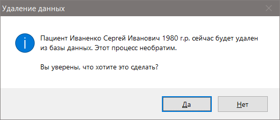

В случае подтверждения действия данные пациента удаляются из БД насовсем

[Вернуться к оглавлению](#page_toc)

---

### Визиты к врачу <a name="34_mnu_patient_visit_list"></a>

Действие позволяет перейти от общего списка пациентов в базе данных к отображению списка визитов пациента к любому из врачей. Соответственно, это позволит добавлять/изменять/удалять данные этих визитов для выбранного пациента.

Перейти от общего списка к списку визитов можно несколькими способами
- из соответствующего пункта меню


- из панели инструментов 


- при помощи "горячей	клавиши" `F6`
- нажав на клавишу `Enter` или сделав дабл клик левой кнопкой мыши на выделенном пациенте


При этом можно посмотреть детали визита (полный диагноз, лечение, рекомендации, манипуляции) в виде всплывающих подсказок при наведении мыши на соответствующие ячейки таблицы. 

[Вернуться к оглавлению](#page_toc)

---

### Добавить новый визит <a name="35_mnu_patient_visit_add"></a>

Пункт меню становится доступным после [перехода к списку визитов](#34_mnu_patient_visit_list) пациента к врачам.

Действие позволяет добавить данные нового визита к любому врачу в базе данных. Вызывается либо из либо пункта меню


либо из панели инструментов


либо при помощи "горячей клавиши" `Ctrl+N`

<u>**Обратите внимание:**</u> при отсутствии каких-либо визитов текущего пациента пункты меню для редактирования/удаления данных визита будут недоступны.

Результатом вызова действия будет открытие [окна работы с данными визита](#38_mnu_patient_visit_window).

[Вернуться к оглавлению](#page_toc)

---

### Редактировать данные визита <a name="36_mnu_patient_visit_edit"></a>

Пункт меню становится доступным после [перехода к списку визитов](#34_mnu_patient_visit_list) пациента к врачам при наличии хотя бы одного визита.

Действие позволяет отредактировать данные текущего визита к врачу в базе данных. Вызывается либо из либо пункта меню


либо из панели инструментов


либо при помощи "горячей клавиши" `Ctrl+E`

Результатом вызова действия будет открытие [окна работы с данными визита](#38_mnu_patient_visit_window).

[Вернуться к оглавлению](#page_toc)

---

### Удалить данные визита из базы <a name="37_mnu_patient_visit_del"></a>

Пункт меню становится доступным после [перехода к списку визитов](#34_mnu_patient_visit_list) пациента к врачам при наличии хотя бы одного визита.

Действие позволяет отредактировать данные текущего визита к врачу в базе данных. Вызывается либо из либо пункта меню


либо из панели инструментов


либо при помощи "горячей клавиши" `Ctrl+D`

После вызова данного действия появится окно с запросом на удаление данных


В случае подтверждения данные визита будут удалены.

[Вернуться к оглавлению](#page_toc)

---

### Окно работы с данными визита <a name="38_mnu_patient_visit_window"></a>

Предназначено для работы с внесением/изменением данных визита, которые включают в себя разнообразную информацию - от жалоб, осмотра, результатов исследований до диагнозов, лечения и рекомендаций.

При открытии окна оно примет следующий вид


Если при открытии окна появилось всплывающее уведомление (и иконка в трее в виде флажка)


значит для данного пациента имеется одна или несколько заметок, на которые стоит обратить внимание (подробнее о работе с заметками можно прочитать [здесь](#3311_mnu_patient_notes)). 

Цифрами на скрине обозначены следующие области

1. заголовок - указывается ФИО пациента, для которого вводятся данные. В скобках указан режим (добавление или редактирование) ввода данных
2. вкладки - все вводимые данные для удобства сгруппированы по 6 вкладкам. Более подробное описание в этом же разделе ниже
3. кнопки "листания" вкладок
- `Далее >>` открывает вкладку справа от текущей (будет неактивна при отображении самой правой вкладки), вызывается "горячими клавишами" `Ctrl+Shift` + `стрелка вправо`

	

- `<< Назад` открывает вкладку слева от текущей (будет неактивна при отображении самой левой вкладки), вызывается "горячими клавишами" `Ctrl+Shift` + `стрелка влево`

	

4. кнопка `Сохранить` - сохраняет результат вашего труда, вызывается "горячими клавишами" `Ctrl+Enter`

	

5. кнопка `Отмена` - закрывает окно без сохранения результатов правок данных, вызывается "горячей клавишей" `Esc`

	

<u>**Обратите внимание:**</u> после нажатия кнопки `Отмена` во избежание случайной потери данных появляется диалог, требующий подтверждения ваших действий


[Вернуться к оглавлению](#page_toc)

---

Как упоминалось выше, для удобства работы с данными все они распределены по шести вкладкам. Ниже приведено их детальное описание.

#### Вкладка "Жалобы пациента" <a name="381_mnu_patient_visit_complaints"></a>

В верхней части вкладки расположены следующие элементы


1. "Вид приема" - можно выбрать первичный или повторный
2. "Дата приема" - можно выбрать произвольную дату (при добавлении данных визита задается по умолчанию текущая, при редактировании - последняя сохраненная)
3. "Лечащий врач" - указываются данные врача, который осуществляет прием. Если в базе нет "нужного" доктора или вообще отсутствуют данные о врачах (например вы только начали работу), появится предупреждающая надпись

	

	Чтобы добавить нового доктора, необходимо нажать кнопку с тремя точками справа от списка. При этом откроется [соответствующая форма](#42_mnu_medical) для добавления/редактирования данных с докторами.

4. "Название ЛПУ" - указывается текущее подразделение ЛПУ, в котором осуществляется прием данного пациента. Если в базе нет "нужного" ЛПУ или вообще отсутсвуют данные о ЛПУ (например вы только начали работу), появится предупреждающая надпись

	

	Чтобы добавить новое ЛПУ, необходимо нажать кнопку с тремя точками справа от списка. При этом откроется [соответствующая форма](#43_mnu_hospital) для добавления/редактирования данных ЛПУ.
	
Ниже мы можем увидеть множество вариантов жалоб и причин визита, тематически разделенных на три вкладки:
1. "Андрологические жалобы"

	
	
2. "Урологические жалобы"

	

3. "Прочие"

	
	
 Их содержимое очевидно и не требует специального пояснения. Текст жалоб формируются автоматически при переключении на вкладку "Анамнез заболевания" на основе выбранных меток и списков. Переключение между вкладками осуществляется при помощи мыши или "горячих клавиш" `Ctrl+Shift+Alt` + `стрелка влево`/`стрелка вправо`
 


[Вернуться к оглавлению](#page_toc)

---

#### Вкладка "Анамнез заболевания" <a  name="382_mnu_patient_visit_anamnesis"></a>

Отображает анамнестические данные


1. Текстовое поле с жалобами, которые изначально формируется на основании выбранных на вкладке ["Жалобы пациента"](#381_mnu_patient_visit_complaints) меток и списков.
2. Содержимое поля можно не только отредактировать, но и отформатировать в отдельном окне простейшего [редактора текста](#8_mnu_db_editor), нажав на кнопку `Формат`. 
3. Текстовое поле, где можно указать сведения, которые можно отображать/скрывать из печати в зависимости от того, отмечен или нет чекбокс "Указывать эти сведения в амбулаторной карте". В любом случае, эти сведения будут видны врачу, который открывает данные визита в режиме редактирования.
4. Вкладки с логически сгруппированными анамнестическими данными.
- вкладка "Общий анамнез" позволяет указать 
	- аллергологический анамнез путем ручного ввода или при помощи шаблона. Если оставить отмеченной радиокнопку "не отягощен" это же значение будет отображаться при выводе на печать
	
	
	
	- чекбокс "вредные привычки и перенесенные заболевания" позволяет указать оные

	
	
	
	- вкладка "андрологический анамнез"(для мужчин) позволяет указать андрологические анамнестические данные
 
	

	- вкладка "гинекологический анамнез"(для женщин) позволяет указать гинекологические анамнестические данные 

	

	- чекбокс "половой анамнез" позволяет указать особенности половой жизни пациента и перенесенные секс-инфекции 
	
	
	
Переключение между вкладками осуществляется при помощи мыши или "горячих клавиш" `Ctrl+Shift+Alt` + `стрелка влево`/`стрелка вправо`

	

[Вернуться к оглавлению](#page_toc)

---

#### Вкладка "Общий осмотр" <a name="383_mnu_patient_visit_praesens"></a>

Позволяет вводить данные физикального и специфического осмотров.


Цифрами обозначены:
1. [Status praesens](#3831_mnu_patient_visit_st_praesens)
2. [Status localis](#3832_mnu_patient_visit_st_localis)
3. [Осмотр per rectum (для мужчин)](#3833_mnu_patient_visit_perrectum)
4. [Осмотр per vaginum (для женщин)](#3834_mnu_patient_visit_pervaginum)


##### 1. Status praesens <a name="3831_mnu_patient_visit_st_praesens"></a> 

Позволяет быстро и шаблонно описать текущее общее состояние пациента. Например, при помощи отметки соответствующей радиокнопки 


<u>**Обратите внимание:**</u> радиокнопки "без особенностей" и "без отрицательной динамики" позволяет быстро ввести "стандартные" фразы, позволяющие не загромождать протокол несущественными деталями (например, при повторных осмотрах или осмотрах в динамике). Если выбрана радиокнопка "требуется описать", становится доступной кнопка `Шаблон`, которая позволяет вызывать форму-шаблон с описанием текущего статуса


<u>**Обратите внимание:**</u> в новой версии программы вам не удастся ввести данные о состоянии лимфатических узлов непосредственно из этого окна


После нажатия кнопки с тремя точками будет вызвана форма осмотра на сифилис с неактивными радиокнопкам. 


Чтобы изменить данные о состоянии лимфатических узлов необходимо открыть эту же форму из вкладки ["Лабораторные исследования"](#3841_mnu_patient_visit_labor_common) 

После сохранения результатов выбора в поле редактирования появится автоматически сформированный текст. 


Его можно отредактировать, а также отформатировать в отдельном окне простейшего [редактора текста](#8_mnu_db_editor), нажав на кнопку `Формат`.

Если вы хотите сохранить какие-нибудь изображения, связанные с физикальным осмотром, можно вызвать специальную форму, нажав на кнопку `Снимки`.


Внутри нее можно добавлять/удалять фотографии в формате bmp/jpg/jpeg/png. Форма позволяет сохранять до 4х снимков на один прием.

	
##### 2. Status localis <a name="3832_mnu_patient_visit_st_localis"></a>

Позволяет быстро и шаблонно описать результаты "местного" (как правило, гениталии) осмотра пациента. Например, при помощи отметки соответствующей радиокнопки


<u>**Обратите внимание:**</u> радиокнопки "без патологии" и "без отрицательной динамики" позволяет быстро ввести "стандартные" фразы, позволяющие не загромождать протокол несущественными деталями (например, при повторных осмотрах или осмотрах в динамике). Если выбрана радиокнопка "требуется описать", становится доступной кнопка `Шаблон`, которая позволяет вызывать форму-шаблон с описанием текущего локального статуса


После сохранения результатов выбора в поле редактирования появится автоматически сформированный текст. 


Его можно отредактировать, а также отформатировать в отдельном окне простейшего [редактора текста](#8_mnu_db_editor), нажав на кнопку `Формат`.

Если вы хотите сохранить какие-нибудь изображения, связанные с физикальным осмотром, можно вызвать специальную форму, нажав на кнопку `Снимки`.


Внутри нее можно добавлять/удалять фотографии в формате bmp/jpg/jpeg/png. Форма позволяет сохранять до 4х снимков на один прием.

##### 3. Осмотр per rectum (для мужчин) <a name="3833_mnu_patient_visit_perrectum"></a>

Позволяет быстро и шаблонно описать результаты ректального осмотра пациента. Например, при помощи отметки соответствующей радиокнопки


<u>**Обратите внимание:**</u> радиокнопки "без патологии" и "от осмотра воздержался" позволяет быстро ввести "стандартные" фразы, позволяющие не загромождать протокол несущественными деталями (например, при повторных осмотрах или осмотрах в динамике). Если выбрана радиокнопка "требуется описать", становится доступной кнопка `Шаблон`, которая позволяет вызывать форму-шаблон с описанием результатов ректального осмотра


После сохранения результатов выбора в поле редактирования появится автоматически сформированный текст. 


Его можно отредактировать, а также отформатировать в отдельном окне простейшего [редактора текста](#8_mnu_db_editor), нажав на кнопку `Формат`.


##### 4. Осмотр per vaginum (для женщин) <a name="3834_mnu_patient_visit_pervaginum"></a>
- не реализовано.

[Вернуться к оглавлению](#page_toc)

---

#### Вкладка "Лабораторные исследования" <a name="384_mnu_patient_visit_labor"></a>

Позволяет вводить данные лабораторных исследований.


Логически все вводимые данных сгруппированы на трех вкладках. Переключение между вкладками осуществляется при помощи мыши или "горячих клавиш" `Ctrl+Shift+Alt` + `стрелка влево`/`стрелка вправо`

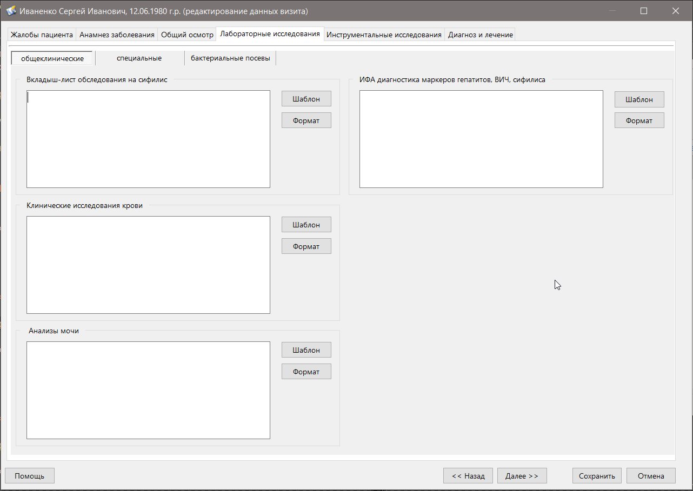

1. [Общеклинические исследования](#3841_mnu_patient_visit_labor_common)
2. [Специальные исследования](#3842_mnu_patient_visit_labor_special)
3. [Бактериальные посевы](#3843_mnu_patient_visit_labor_bact)

Рассмотрим вкладки подробнее.

##### 1. Общеклинические исследования <a name="3841_mnu_patient_visit_labor_common"></a>

Вкладка содержит следующие поля ввода:
- ***вкладыш-лист обследования на сифилис*** - позволяет отобразить результаты внешнего осмотра на сифилис. После нажатия на кнопку `Шаблон` откроется форма-шаблон, где можно сделать соответствующие пометки

	

	После сохранения результатов осмотра автоматически сформированный текст отобразится в поле ввода

	

	Его можно отредактировать, а также отформатировать в отдельном окне простейшего [редактора текста](#8_mnu_db_editor), нажав на кнопку `Формат`.

- ***клинические исследования крови*** - позволяет ввести данные некоторых клинических исследований крови. После нажатия на кнопку `Шаблон` откроется форма-шаблон с шестью вкладками. Вводимые показатели очевидны и не требуют пояснения

	
	
	На некоторых вкладках можно сохранить изображения результатов исследований. После нажатия кнопки `Снимок` откроется форма, где можно выбрать изображение для дальнейшего его сохранения в базе данных
	
	
	
	После сохранения результатов ввода клинических исследований будет автоматически сформирован текст на основании ранее введенных данных.
	
	
	
	Его можно отредактировать, а также отформатировать в отдельном окне простейшего [редактора текста](#8_mnu_db_editor), нажав на кнопку `Формат`.
	
- ***анализы мочи*** - позволяет ввести данные мочи. После нажатия на кнопку `Шаблон` откроется форма-шаблон, позволяющая быстро ввести результаты наиболее распространенных общего анализа мочи и анализа мочи по Нечипоренко

	
	
	Поля ввода становятся доступны при пометке соответствующего чекбокса. После ввода данных и нажатии кнопки `Сохранить` будет автоматически сформирован текст на основании ранее введенных данных.
	
	
	
	Его можно отредактировать, а также отформатировать в отдельном окне простейшего [редактора текста](#8_mnu_db_editor), нажав на кнопку `Формат`.	
	
- ***ИФА диагностика маркеров гепатитов, ВИЧ, сифилиса*** - позволяет вводить результаты исследований на данные инфекции. После нажатия на кнопку `Шаблон` откроется соответствующая форма-шаблон

	
	
	После ввода данных и нажатии кнопки `Сохранить` будет автоматически сформирован текст на основании ранее введенных данных.
	
	
	
	Его можно отредактировать, а также отформатировать в отдельном окне простейшего [редактора текста](#8_mnu_db_editor), нажав на кнопку `Формат`.	

[Вернуться к оглавлению](#page_toc)

---

##### 2. Специальные исследования <a name="3842_mnu_patient_visit_labor_special"></a>

Вкладка содержит следующие поля ввода:
- ***мазок из уретры*** - позволяет вводить данные микроскопии исследования уретрального содержимого. После нажатия на кнопку `Шаблон` откроется соответствующая форма-шаблон

	
	
	После ввода данных и нажатии кнопки `Сохранить` будет автоматически сформирован текст на основании ранее введенных данных. 

	
	
	Его можно отредактировать, а также отформатировать в отдельном окне простейшего [редактора текста](#8_mnu_db_editor), нажав на кнопку `Формат`.	
	
	Если вы хотите сохранить какие-нибудь изображения, например изображения мазков, можно вызвать специальную форму, нажав на кнопку `Снимки`.
	
	

- ***мазок сока простаты*** - позволяет вводить данные микроскопии сока предстательной железы. После нажатия на кнопку `Шаблон` откроется соответствующая форма-шаблон

	
	
	После ввода данных и нажатии кнопки `Сохранить` будет автоматически сформирован текст на основании ранее введенных данных. 

	
	
	Его можно отредактировать, а также отформатировать в отдельном окне простейшего [редактора текста](#8_mnu_db_editor), нажав на кнопку `Формат`.	
	
	Если вы хотите сохранить какие-нибудь изображения, например изображения мазков, можно вызвать специальную форму, нажав на кнопку `Снимки`.

	
	
- ***исследование эякулята*** - позволяет вводить данные микроскопии сока предстательной железы. После нажатия на кнопку `Шаблон` откроется соответствующая форма-шаблон
	
	
	
	

	Переключаться между вкладками можно при помощи кнопок `<< Назад`/`Далее >>`, мыши или "горячих клавиш" `Ctrl+Shift+Alt` + `стрелка влево`/`стрелка вправо`

	
	
	После ввода данных и нажатии кнопки `Сохранить` будет автоматически сформирован текст на основании ранее введенных данных. 

		
	
	Его можно отредактировать, а также отформатировать в отдельном окне простейшего [редактора текста](#8_mnu_db_editor), нажав на кнопку `Формат`.
	
	Если вы хотите сохранить какие-нибудь изображения, например мазков или бланков спермограммы, можно вызвать специальную форму, нажав на кнопку `Снимки`.
	
	
		
- ***определение ИППП методом ПЦР*** - позволяет вводить данные наиболее распространенных секс-инфекций методом ПЦР (качественный метод определения). После нажатия на кнопку `Шаблон` откроется соответствующая форма-шаблон

	
	
	После ввода данных и нажатии кнопки `Сохранить` будет автоматически сформирован текст на основании ранее введенных данных. 

		
	
	Его можно отредактировать, а также отформатировать в отдельном окне простейшего [редактора текста](#8_mnu_db_editor), нажав на кнопку `Формат`.
	
	Если вы хотите сохранить какие-нибудь изображения, например бланков исследований, можно вызвать специальную форму, нажав на кнопку `Снимки`.
	
	
	
- ***определение ИППП методом ИФА*** - позволяет вводить данные наиболее распространенных секс-инфекций методом ИФА. После нажатия на кнопку `Шаблон` откроется соответствующая форма-шаблон

	
	
	После ввода данных и нажатии кнопки `Сохранить` будет автоматически сформирован текст на основании ранее введенных данных. 

		
	
	Его можно отредактировать, а также отформатировать в отдельном окне простейшего [редактора текста](#8_mnu_db_editor), нажав на кнопку `Формат`.
	
	Если вы хотите сохранить какие-нибудь изображения, например бланков исследований, можно вызвать специальную форму, нажав на кнопку `Снимки`.
	
	

[Вернуться к оглавлению](#page_toc)

---

##### 3. Бактериальные посевы <a name="3843_mnu_patient_visit_labor_bact"></a>

Вкладка содержит следующие поля ввода:

- ***бактериальный посев отделяемого из уретры*** - позволяет вводить данные результатов бактериального посева из уретры. После нажатия на кнопку `Шаблон` откроется соответствующая форма-шаблон

	
	
	После ввода данных и нажатии кнопки `Сохранить` будет автоматически сформирован текст на основании ранее введенных данных. 

		
	
	Его можно отредактировать, а также отформатировать в отдельном окне простейшего [редактора текста](#8_mnu_db_editor), нажав на кнопку `Формат`.
	
- ***бактериальный посев сока предстательной железы*** - позволяет вводить данные результатов бактериального посева сока простаты. После нажатия на кнопку `Шаблон` откроется соответствующая форма-шаблон

	
	
	После ввода данных и нажатии кнопки `Сохранить` будет автоматически сформирован текст на основании ранее введенных данных. 

		
	
	Его можно отредактировать, а также отформатировать в отдельном окне простейшего [редактора текста](#8_mnu_db_editor), нажав на кнопку `Формат`.	
	
- ***бак.исследование на микоплазму и уреаплазму*** - позволяет вводить данные результатов бактериального посева на micoplasma hominis и ureaplasma urealyticum. После нажатия на кнопку `Шаблон` откроется соответствующая форма-шаблон

	
	
	После ввода данных и нажатии кнопки `Сохранить` будет автоматически сформирован текст на основании ранее введенных данных. 

		
	
	Его можно отредактировать, а также отформатировать в отдельном окне простейшего [редактора текста](#8_mnu_db_editor), нажав на кнопку `Формат`.		
	
- ***бактериальный посев мочи*** - позволяет вводить данные результатов бактериального посева мочи. После нажатия на кнопку `Шаблон` откроется соответствующая форма-шаблон

	
	
	После ввода данных и нажатии кнопки `Сохранить` будет автоматически сформирован текст на основании ранее введенных данных. 

		
	
	Его можно отредактировать, а также отформатировать в отдельном окне простейшего [редактора текста](#8_mnu_db_editor), нажав на кнопку `Формат`.	

[Вернуться к оглавлению](#page_toc)

---

#### Вкладка "Инструментальные исследования" <a name="385_mnu_patient_visit_instrumental"></a>

Позволяет вводить и сохранять данные инструментальных исследований. 


Логически данные сгруппированы по следующим блокам:

1. [УЗИ почек и мочевого пузыря](#3851_mnu_patient_visit_instr_UZI_ren)
2. [УЗИ гениталий и простаты](#3852_mnu_patient_visit_instr_UZI_genit)
3. ["Сухая" передняя уретроскопия](#3853_mnu_patient_visit_instr_dry_scope)
4. [Ирригационная уретроскопия](#3854_mnu_patient_visit_instr_irrig_scope)

##### 1. УЗИ почек и мочевого пузыря <a name="3851_mnu_patient_visit_instr_UZI_ren"></a>

Позволяет сохранять данные УЗ-исследований почек и мочевого пузыря. После нажатия на кнопку `Шаблон` откроется соответствующая форма-шаблон, состоящая из двух вкладок


Переключение между вкладками осуществляется при помощи мыши, кнопок `<< Назад`/`Далее >>` или "горячих клавиш" `Ctrl+Shift` + `стрелка влево`/`стрелка вправо`

"Включить/выключить" то или иное исследование в протокол можно, нажав соответствующие чекбоксы


После ввода данных и нажатии кнопки `Сохранить` будет автоматически сформирован текст на основании ранее введенных данных. 


	
Его нужно отредактировать (обратите внимание, "готового" заключения нет - вам придется писать его самим), а также можно отформатировать в отдельном окне простейшего [редактора текста](#8_mnu_db_editor), нажав на кнопку `Формат`.	

Если вы хотите сохранить какие-нибудь изображения, можно вызвать специальную форму, нажав на кнопку `Снимки`.
	


[Вернуться к оглавлению](#page_toc)

---

##### 2. УЗИ гениталий и простаты <a name="3852_mnu_patient_visit_instr_UZI_genit"></a>

Позволяет сохранять данные УЗ-исследований предстательной железы, органов мошонки, УЗДГ сосудов полового члена и мошонки. После нажатия на кнопку `Шаблон` откроется соответствующая форма-шаблон, состоящая из четырех вкладок


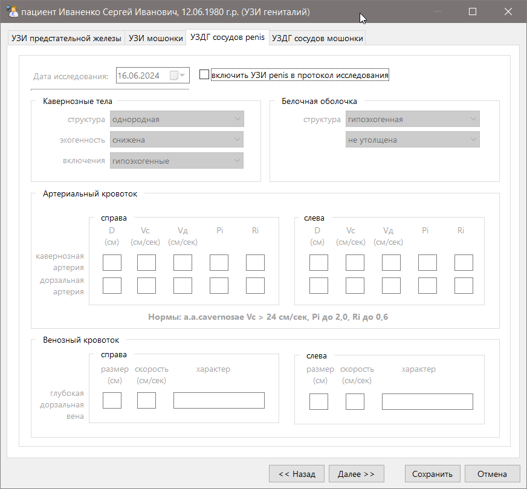


Переключение между вкладками осуществляется при помощи мыши, кнопок `<< Назад`/`Далее >>` или "горячих клавиш" `Ctrl+Shift` + `стрелка влево`/`стрелка вправо`

"Включить/выключить" то или иное исследование в протокол можно, нажав соответствующие чекбоксы


После ввода данных и нажатии кнопки `Сохранить` будет автоматически сформирован текст на основании ранее введенных данных. 


	
Его нужно отредактировать (обратите внимание, "готового" заключения нет - вам придется писать его самим), а также можно отформатировать в отдельном окне простейшего [редактора текста](#8_mnu_db_editor), нажав на кнопку `Формат`.	

Если вы хотите сохранить какие-нибудь изображения, можно вызвать специальную форму, нажав на кнопку `Снимки`.
	


[Вернуться к оглавлению](#page_toc)

---

##### 3. "Сухая" передняя уретроскопия <a name="3853_mnu_patient_visit_instr_dry_scope"></a>

Позволяет сохранять данные "сухой" передней уретроскопии, выполняемой при помощи комбинированного уретроскопа "Валентина". После нажатия на кнопку `Шаблон` откроется соответствующая форма-шаблон


После ввода данных и нажатии кнопки `Сохранить` будет автоматически сформирован текст на основании ранее введенных данных. 


	
Его нужно отредактировать (обратите внимание, "готового" заключения нет - вам придется писать его самим), а также можно отформатировать в отдельном окне простейшего [редактора текста](#8_mnu_db_editor), нажав на кнопку `Формат`.	

Если вы хотите сохранить какие-нибудь изображения, можно вызвать специальную форму, нажав на кнопку `Снимки`.
	
[Вернуться к оглавлению](#page_toc)

---

##### 4. Ирригационная уретроскопия <a name="3854_mnu_patient_visit_instr_irrig_scope"></a>

Позволяет сохранять данные ирригационной уретроскопии. После нажатия на кнопку `Шаблон` откроется соответствующая форма-шаблон, состоящая из двух вкладок


Переключение между вкладками осуществляется при помощи мыши, кнопок `<< Назад`/`Далее >>` или "горячих клавиш" `Ctrl+Shift` + `стрелка влево`/`стрелка вправо`


После ввода данных и нажатии кнопки `Сохранить` будет автоматически сформирован текст на основании ранее введенных данных. 


	
Его нужно отредактировать (обратите внимание, "готового" заключения нет - вам придется писать его самим), а также можно отформатировать в отдельном окне простейшего [редактора текста](#8_mnu_db_editor), нажав на кнопку `Формат`.	

Если вы хотите сохранить какие-нибудь изображения, можно вызвать специальную форму, нажав на кнопку `Снимки`.
	


[Вернуться к оглавлению](#page_toc)

#### Вкладка "Диагноз и лечение" <a name="386_mnu_patient_visit_treatment"></a>

Позволяет вводить итоговые данные в виде диагноза, лечения, манипуляций и рекомендаций. 


Логически данные сгруппированы по следующим блокам:

1. [Медикаментозное лечение](#3861_mnu_patient_visit_treatment_treat)
2. [Диагноз](#3862_mnu_patient_visit_treatment_ds)
3. [Местные манипуляции](#3863_mnu_patient_visit_treatment_manip)
4. [Рекомендации](#3864_mnu_patient_visit_treatment_recom)


##### 1. Медикаментозное лечение <a name="3861_mnu_patient_visit_treatment_treat"></a>

Поле ввода позволяет записывать и сохранять назначаемое пациенту медикаментозное лечение. После нажатия на кнопку `Шаблон` откроется соответствующая форма-шаблон


где цифрами обозначены следующие моменты:
1. ФИО врача, назначающего препараты (обычно проставляется ФИО того доктора, который осуществляет прием). Поле требуется для указания ФИО врача в рецепте. Если в выпадающем списке нет "нужного" врача, необходимо нажать на кнопку `...` справа от списка и  добавить/отредактировать данные врача (подробнее этот процесс описан [здесь](#42_mnu_medical))
2. Список потенциально доступных для назначения пациенту лекарственных препаратов
3. Кнопки добавления/изменения/удаления препаратов в списке. Подробнее этот процесс описан [здесь](#48_mnu_drug_list).
4. Кнопки переноса препаратов из списка доступных препаратов (расположен слева) в список назначенных пациенту препаратов (расположен справа). Переносить выбранные элементы слева направо и наоборот можно 
	- при помощи кнопок `<`/`>` (перенос одной или нескольких выбранных записей) или "горячих клавиш" `Ctrl+Shift` + `стрелка влево`/`стрелка вправо`
	
		
		
	- при помощи кнопок `<<`/`>>` (перенос всех записей из одного списка в другой) или "горячих клавиш" `Ctrl+Shift+Alt` + `стрелка влево`/`стрелка вправо`
	
		
		
	- путем перетаскивания мышью	
		
		
		
		<u>**обратите внимание:**</u> сразу несколько записей можно отметить, если держать зажатой кнопку `Ctrl` и помечать записи левой кнопкой мыши (о чем сообщает надпись ниже левой таблички).
		
		<u>**обратите внимание:**</u> переключаться между списками можно при помощи "горячих клавиш" `Ctrl+Alt+Z` (активный список выделяется светло-голубым цветом)
		
				
	
5. Список назначенных пациенту лекарственных препаратов. При пустом списке будет отображаться соответствующая подсказка
6. Группа кнопок, при помощи которых можно распечатать рецепт на выбранный препарат. Сообразно логике эти кнопки будут отображаться при условии, что выбран один единственный препарат в левом списке. Подробнее процесс распечатки рецепта описан [здесь](#48_mnu_drug_list).

После добавления хотя бы одного препарата в правый список появляется кнопка `Выбрать`


	
нажатие на которую сохраняет результаты выбора. Соответственно, нажатие кнопки `Закрыть` отменяет выбор. В случае сохранения результатов выбора будет автоматически сформирован текст медикаментозного лечения


Его можно отредактировать или отформатировать в отдельном окне простейшего [редактора текста](#8_mnu_db_editor), нажав на кнопку `Формат`.

[Вернуться к оглавлению](#page_toc)

---

##### 2. Диагноз <a name="3862_mnu_patient_visit_treatment_ds"></a>

Поле ввода позволяет записывать и сохранять выставленные пациенту диагнозы. После нажатия на кнопку `Шаблон` откроется соответствующая форма-шаблон


где цифрами обозначены следующие моменты:
1. Список потенциально доступных для выставления пациенту диагнозов
2. Кнопки добавления/изменения/удаления диагнозов в списке. Подробнее этот процесс описан [здесь](#49_mnu_ds_list).
3. Кнопки переноса из списка доступных диагнозов (расположен слева) в список выставленных пациенту диагнозов (расположен справа). Переносить выбранные элементы слева направо и наоборот можно 
	- при помощи кнопок `<`/`>` (перенос одной или нескольких выбранных записей) или "горячих клавиш" `Ctrl+Shift` + `стрелка влево`/`стрелка вправо`
	
		
		
	- при помощи кнопок `<<`/`>>` (перенос всех записей из одного списка в другой) или "горячих клавиш" `Ctrl+Shift+Alt` + `стрелка влево`/`стрелка вправо`
	
		
		
	- путем перетаскивания мышью	
		
		
		
		<u>**обратите внимание:**</u> сразу несколько записей можно отметить, если держать зажатой кнопку `Ctrl` и помечать записи левой кнопкой мыши (о чем сообщает надпись ниже левой таблички).
		
		<u>**обратите внимание:**</u> переключаться между списками можно при помощи "горячих клавиш" `Ctrl+Alt+Z` (активный список выделяется светло-голубым цветом)
		
				
	
4. Список выставленных пациенту диагнозов. При пустом списке будет отображаться соответствующая подсказка

После добавления хотя бы одного диагноза в правый список появляется кнопка `Выбрать`


	
нажатие на которую сохраняет результаты выбора. Соответственно, нажатие кнопки `Закрыть` отменяет выбор. В случае сохранения результатов выбора будет автоматически сформирован текст с выставленными одним или несколько диагнозами


Его можно отредактировать или отформатировать в отдельном окне простейшего [редактора текста](#8_mnu_db_editor), нажав на кнопку `Формат`.

[Вернуться к оглавлению](#page_toc)

---

##### 3. Местные манипуляции <a name="3863_mnu_patient_visit_treatment_manip"></a>

Поле ввода позволяет записывать и сохранять назначаемое пациенту манипуляции, процедуры  и "местное" лечение. После нажатия на кнопку `Шаблон` откроется соответствующая форма-шаблон


где цифрами обозначены следующие моменты:
1. Список потенциально доступных для назначения пациенту манипуляций
2. Кнопки добавления/изменения/удаления манипуляций и процедур в списке. Подробнее этот процесс описан [здесь](#410_mnu_manip_list).
3. Кнопки переноса элементов из списка доступных манипуляций (расположен слева) в список назначенных пациенту манипуляций (расположен справа). Переносить выбранные элементы слева направо и наоборот можно 
	- при помощи кнопок `<`/`>` (перенос одной или нескольких выбранных записей) или "горячих клавиш" `Ctrl+Shift` + `стрелка влево`/`стрелка вправо`
	
		
		
	- при помощи кнопок `<<`/`>>` (перенос всех записей из одного списка в другой) или "горячих клавиш" `Ctrl+Shift+Alt` + `стрелка влево`/`стрелка вправо`
	
		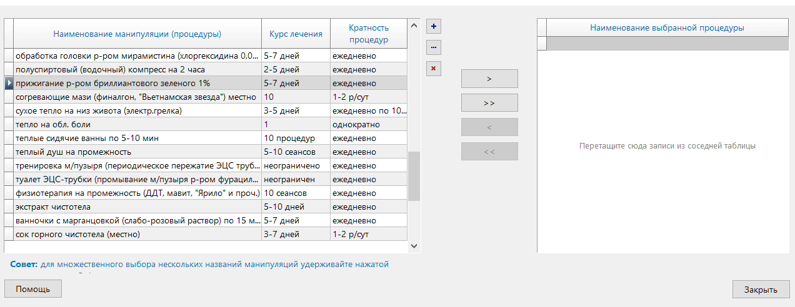
		
	- путем перетаскивания мышью	
		
		
		
		<u>**обратите внимание:**</u> сразу несколько записей можно отметить, если держать зажатой кнопку `Ctrl` и помечать записи левой кнопкой мыши (о чем сообщает надпись ниже левой таблички).
		
		<u>**обратите внимание:**</u> переключаться между списками можно при помощи "горячих клавиш" `Ctrl+Alt+Z` (активный список выделяется светло-голубым цветом)
		
				
	
4. Список назначенных пациенту манипуляций. При пустом списке будет отображаться соответствующая подсказка

После добавления хотя бы одной манипуляции в правый список появляется кнопка `Выбрать`


	
нажатие на которую сохраняет результаты выбора. Соответственно, нажатие кнопки `Закрыть` отменяет выбор. В случае сохранения результатов выбора будет автоматически сформирован текст со списком манипуляций


Его можно отредактировать или отформатировать в отдельном окне простейшего [редактора текста](#8_mnu_db_editor), нажав на кнопку `Формат`.

[Вернуться к оглавлению](#page_toc)

---

##### 4. Рекомендации <a name="3864_mnu_patient_visit_treatment_recom"></a>

Поле ввода позволяет записывать и сохранять даваемые пациенту рекомендации. После нажатия на кнопку `Шаблон` откроется соответствующая форма-шаблон


где цифрами обозначены следующие моменты:
1. Список потенциально доступных пациенту рекомендаций 
2. Кнопки добавления/изменения/удаления рекомендаций в списке. Подробнее этот процесс описан [здесь](#411_mnu_recom_list).
3. Кнопки переноса элементов из списка доступных рекомендаций (расположен слева) в список назначенных пациенту рекомендаций (расположен справа). Переносить выбранные элементы слева направо и наоборот можно 
	- при помощи кнопок `<`/`>` (перенос одной или нескольких выбранных записей) или "горячих клавиш" `Ctrl+Shift` + `стрелка влево`/`стрелка вправо`
	
		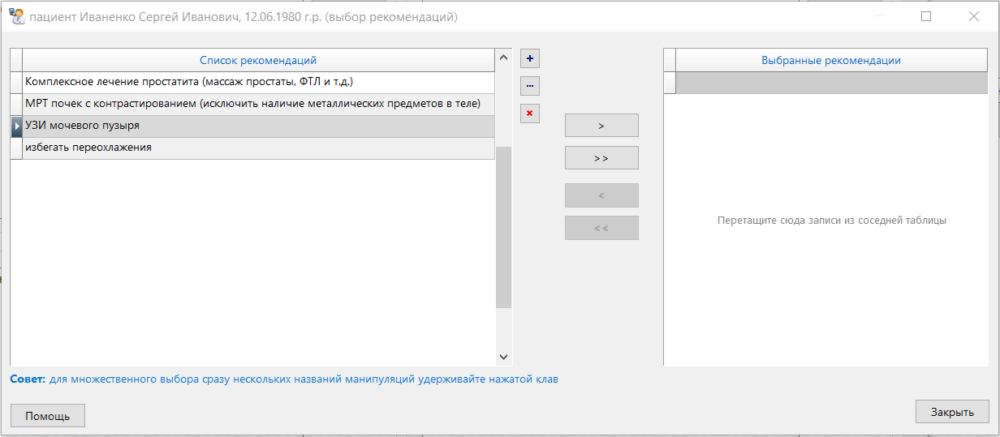
		
	- при помощи кнопок `<<`/`>>` (перенос всех записей из одного списка в другой) или "горячих клавиш" `Ctrl+Shift+Alt` + `стрелка влево`/`стрелка вправо`
	
		
		
	- путем перетаскивания мышью	
		
		
		
		<u>**обратите внимание:**</u> сразу несколько записей можно отметить, если держать зажатой кнопку `Ctrl` и помечать записи левой кнопкой мыши (о чем сообщает надпись ниже левой таблички).
		
		<u>**обратите внимание:**</u> переключаться между списками можно при помощи "горячих клавиш" `Ctrl+Alt+Z` (активный список выделяется светло-голубым цветом)
		
				
	
4. Список выбранных пациенту рекомендаций. При пустом списке будет отображаться соответствующая подсказка

После добавления хотя бы одной рекомендации в правый список появляется кнопка `Выбрать`


	
нажатие на которую сохраняет результаты выбора. Соответственно, нажатие кнопки `Закрыть` отменяет выбор. В случае сохранения результатов выбора будет автоматически сформирован текст со списком рекомендаций


Его можно отредактировать или отформатировать в отдельном окне простейшего [редактора текста](#8_mnu_db_editor), нажав на кнопку `Формат`.

[Вернуться к оглавлению](#page_toc)

---

### Общий список пациентов <a name="39_mnu_patient_total_list"></a>

Действие позволяет перейти от списка визитов к врачам текущего пациента к отображению общего списка пациента в базе данных (т.е. осуществить действие, обратное действию ["Визиты к врачу"](#34_mnu_patient_visit_list)). 

Перейти от списка визитов к общему списку пациентов можно несколькими способами
- из соответствующего пункта меню


- из панели инструментов 


- при помощи "горячей	клавиши" `F7`
- нажав на клавишу `Esc`

[Вернуться к оглавлению](#page_toc)

---

### "Платежи" <a name="3310_mnu_patient_payments"></a>

Действие позволяет вносить и сохранять данные о платежах пациента. Вызвать его можно несколькими способами:
- из соответствующего пункта меню


- из панели инструментов 


- при помощи "горячей	клавиши" `Ctrl+M` 

После вызова действия появится соответствующее окно


При отсутствии сведений о платежах в табличке будет отображаться соответствующая подсказка, а из всех кнопок-модификаторов (указано стрелкой) доступна только кнопка добавления записи.

Чтобы добавить запись, нажмем на кнопку с плюсиком ("горячая клавиша" `Ctrl+N`).


При этом откроется панель с редактируемыми данными


Цифрами обозначены:
1. ***Дата платежа***
2. ***Начисленный платеж*** - сумма платежей за одну или несколько выставленных к оплате медицинских услуг. Сумму можно вводить как вручную, так и выбрав из текущего прайс-листа. Для этого надо нажать на кнопку `...` справа от поля ввода (указана стрелкой) или вызвать действие при помощи "горячей клавиши" `Ctrl+I`. Будет вызвана с текущим прайс-листом (подробнее о работе с ним можно ознакомится [здесь](#45_mnu_price))

	
	
	Выбрав "нужные" пункты (для "множественного" выбора необходимо, зажав клавишу `Ctrl`, последовательно отметить записи левой кнопкой мыши). Сохранить выбор можно, нажав кнопку `Выбрать`
3. ***Исполненный платеж***	- поле позволяет ввести сумму, которая была уплачена
4. Поле ввода, где можно указать перечень назначение платежа. В случае выбора услуг из прайса текст перечня услуг будет сформирован автоматически

Введенные данные можно сохранить, нажав на кнопку `Сохранить`.


Частично скрытый в ячейках таблички текст перечня услуг можно "подсмотреть", если навести курсор мышки на интересующую ячейку. 

<u>**Обратите внимание:**</u> при наличии хотя бы одной записи в списке становятся доступными кнопки редактирования  `...` ("горячая клавиша" `Ctrl+E`) и удаления `x` ("горячая клавиша" `Ctrl+D`) записи.


[Вернуться к оглавлению](#page_toc)

---

### "Заметки" <a name="3311_mnu_patient_notes"></a>

Действие позволяет вносить и сохранять некоторые заметки и соображения относительно данного пациента. Вызвать его можно несколькими способами:
- из соответствующего пункта меню

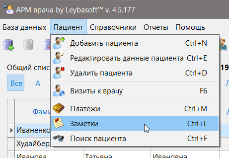

- из панели инструментов 


- при помощи "горячей	клавиши" `Ctrl+L` 

После вызова действия появится соответствующее окно


Если ранее для этого пациента не были введены заметки, список будет пуст, о чем появится соответствующая надпись. Чтобы добавить новую заметку, необходимо нажать на кнопку с `+` (на скрине выше указана стрелкой), после чего откроется панель редактирования


Цифрами обозначены:
1. ***Актуальность заметки*** - позволяет отслеживать, сохраняет ли запись свою актуальность. В списке "актуальные" записи выделены жирным шрифтом (см. картинку ниже)
2. ***Дата заметки*** - при добавлении записи указывается текущая дата
3. ***Эмоции*** - здесь можно указать смайлик, чтобы быстро сориентироваться в обстановке
4. ***Содержание задачи*** - собственно, здесь указывается суть заметки

При нажатии кнопки `Сохранить` в списке показывается вновь добавленная запись. Если запись "актуальна", то она будет выделена жирным шрифтом.


<u>**Обратите внимание:**</u> при наличии хотя бы одной записи в списке становятся доступными кнопки редактирования  `...` ("горячая клавиша" `Ctrl+E`) и удаления `x` ("горячая клавиша" `Ctrl+D`) записи.

<u>**Обратите внимание:**</u> если для пациента имеется хотя бы одна заметка, то:
- в общем списке пациентов в столбце "Заметки" появляется соответствующая запись

	

- при попытке добавить/изменить данные визита пациента к врачу появится всплывающее уведомление о наличии у пациента заметки и анимированный значок в системном трее (это внизу около часиков) в виде флажка. Если нажать на всплывающее уведомление, можно сразу перейти к списку заметок для пациента

	
	
	Это сделано для того, чтобы в запарке работы важные замечания относительно пациента не были пропущены вами или вашими коллегами

[Вернуться к оглавлению](#page_toc)

---

### "Поиск пациента" <a name="3312_mnu_patient_find"></a>

Действие позволяет осуществлять быстрый поиск пациента по одному или нескольким критериям. Доступно только при отображении общего списка пациентов. Вызвать его можно несколькими способами:
- из соответствующего пункта меню


- из панели инструментов 


- при помощи "горячей	клавиши" `Ctrl+F` 

После вызова действия появится соответствующее окно


где цифрами обозначено следующие моменты:
1. ***ФИО*** - поля ввода, которые учитываются при фильтрации списка. "Включаются" соответствующими галочками. Фильтрация осуществляется по частичному совпадению каждого из "включенных" полей без учета регистра символов
2. ***Пол*** - учитывает пол пациента/пациентки
3. ***Год рождения*** - позволяет фильтровать список либо по точной дате рождения, либо по диапазону дат ("от" и "до" определенной даты)

	
	
4. ***Поиск*** - кнопка позволяет запустить процесс фильтрации списка ("горячая клавиша" `Ctrl+F`). Действие можно запускать несколько раз, не закрывая текущего окна, просто меняя критерии поиска
5. ***Список пациентов*** - при первоначальном запуске окна отображается весь список пациентов в базе данных (это <u>**неотфильтрованный**</u> список). После нажатия кнопки `Поиск` в списке будут показаны пациенты, которые удовлетворяют критериям поиска (это <u>**отфильтрованный**</u> список). Например:

	
	
	Обратите внимание, что на скрине отображаются все фамилии, которые содержат в своем составе сочетание символов `хаб`, и имена, которые содержат в своем составе символы `ма`. В заголовке формы отображается количество записей, удовлетворяющих критерию поиска
	
6. ***Перейти к пациенту*** - кнопка ("горячая клавиша" `Ctrl+Enter`) позволяет перейти к найденному пациенту сразу в общем списке пациентов с закрытием окна поиска
	
	
	
Кнопка `Закрыть` соответственно	закрывает окно поиска, возращаясь к общему списку пациентов.

[Вернуться к оглавлению](#page_toc)

---

## 4. Меню "Справочники" <a name="4_mnu_db"></a>

### Населенные пункты <a name="41_mnu_cities"></a>

Действие позволяет добавлять/редактировать населенные пункты в БД, где проживают пациенты. Вызвать его можно несколькими способами:
- из соответствующего пункта меню
 


- из панели инструментов 


- при помощи "горячей	клавиши" `Ctrl+T` 

После вызова действия появится соответствующее окно с имеющимися в БД населенными пунктами (если БД "пуста", вы увидите соответствующее предупреждение)


Чтобы добавить новый населенный пункт, необходимо нажать на кнопку с `+` (на скрине выше указана стрелкой). Откроется панель редактирования


где можно ввести название населенного пункта и его тип (город/село). После нажатия кнопки `Сохранить` населенный пункт будет внесен в базу данных.


<u>**Обратите внимание:**</u> при наличии хотя бы одной записи в списке становятся доступными кнопки редактирования  `...` ("горячая клавиша" `Ctrl+E`) и удаления `x` ("горячая клавиша" `Ctrl+D`) записи.

При удалении населенного пункта из списка появится диалог с подтверждением


Если данный населенный пункт используется в качестве указания места жительства хотя бы одного пациента, то вам будет отказано в удалении этой записи


[Вернуться к оглавлению](#page_toc)

---

### Врачи <a name="42_mnu_medical"></a>

Действие позволяет добавлять/редактировать данные врачей, ведущих прием. Вызвать его можно несколькими способами:
- из соответствующего пункта меню
 


- из панели инструментов 


- при помощи "горячей	клавиши" `Ctrl+Y` 

После вызова действия появится соответствующее окно с имеющимися в БД медработниками (если БД "пуста", вы увидите соответствующее предупреждение)

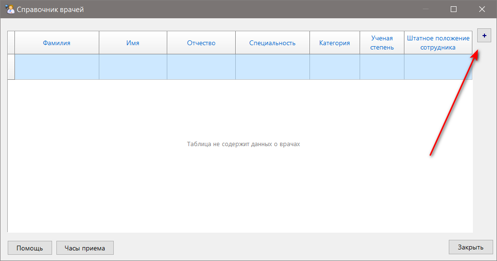

Чтобы добавить данные нового врача, необходимо нажать на кнопку с `+` (на скрине выше указана стрелкой). Откроется панель редактирования


где цифрами обозначены следующие важные моменты:
1. ***ФИО и телефон*** - указываются указанные данные 
2. ***использовать номер для служебного пользования*** - при отметке этого чекбокса номер телефона врача не будет указываться ни на одном документе, который выдается пациенту на руки (например, при [печати расписания приема врача](#57_mnu_db_report_shedul))
3. ***Штатное состояние*** - позволяет указать одно из трех значений статуса врача, как работника

	
	
	Если врач числится "уволенным", это не позволит указывать создавать новые приемы пациентов для него

После нажатия кнопки `Сохранить` данные врача будут внесены в базу данных.


<u>**Обратите внимание:**</u> при наличии хотя бы одной записи в списке становятся доступными кнопки редактирования  `...` ("горячая клавиша" `Ctrl+E`) и удаления `x` ("горячая клавиша" `Ctrl+D`) записи.

При удалении данных врача из списка появится диалог с подтверждением


Если у данного врача имеется хотя бы один прием пациента, то вам будет отказано в удалении этой записи


[Вернуться к оглавлению](#page_toc)

---

### Лечебные учреждения <a name="43_mnu_hospital"></a>

Действие позволяет добавлять/редактировать данные лечебно-профилактического учреждения (ЛПУ), где осуществляется прием пациента. Вызвать его можно несколькими способами:
- из соответствующего пункта меню
 


- из панели инструментов 


- при помощи "горячей	клавиши" `Ctrl+U` 

После вызова действия появится соответствующее окно с имеющимися в БД ЛПУ (если БД "пуста", вы увидите соответствующее предупреждение)


Чтобы добавить данные нового ЛПУ, необходимо нажать на кнопку с `+` (на скрине выше указана стрелкой). Откроется панель редактирования


Назначение большинства полей очевидно и не требует пояснения. Отмечу, что некоторые из них заполнить очень желательно, потому что они будут отображаться в соответствующих полях выписок, осмотров, заключений и т.д. Обратите внимание, в правом углу (выделено и указано стрелкой) имеются кнопки, при помощи которых можно добавить/удалить логотип клиники.

После нажатия кнопки `Сохранить` данные ЛПУ будут внесены в базу данных.


<u>**Обратите внимание:**</u> при наличии хотя бы одной записи в списке становятся доступными кнопки редактирования  `...` ("горячая клавиша" `Ctrl+E`) и удаления `x` ("горячая клавиша" `Ctrl+D`) записи.

При удалении данных ЛПУ из списка появится диалог с подтверждением


Если данное ЛПУ указано как клиника, где оказывалась медицинская услуга, хотя бы у одного пациента, то вам будет отказано в удалении этой записи


[Вернуться к оглавлению](#page_toc)

---

### Расписание приема врача <a name="44_mnu_shedul"></a>

Действие позволяет добавлять/редактировать данные о времени и месте приема врачей. Вызвать его можно несколькими способами:
- из соответствующего пункта меню
 


- из панели инструментов 


- при помощи "горячей	клавиши" `Ctrl+I` 

После вызова действия появится окно с имеющимся в БД списком расписаний приемов (если БД "пуста", вы увидите соответствующее предупреждение)


Чтобы добавить расписание приемов для врача, необходимо нажать на кнопку с `+` (на скрине выше указана стрелкой). Откроется панель редактирования


где цифрами обозначены следующие важные моменты:
1. ***Лечащий врач*** - из выпадающего списка выбирается тот врач, для которого составляется расписание. Добавить/изменить данные нужного доктора можно, нажав на кнопку с тремя точками справа от списка (указано стрелкой). Откроется "Справочник врачей", работа с которым подробно описана [здесь](#42_mnu_medical)
2. ***Название ЛПУ*** - из выпадающего списка выбирается та клиника, где будет осуществлять прием врач, для которого составляется расписание. Добавить/изменить данные нужного ЛПУ можно, нажав на кнопку с тремя точками справа от списка (указано стрелкой). Откроется "Список ЛПУ и клиник", работа с которым подробно описана [здесь](#43_mnu_hospital)
3. ***Время приема*** - логически разделено на дни недели. При отметке чекбокса возле соответствующего дня недели становятся доступными выпадающие списки со временем приема
4. ***Перерыв*** - время "обеденного перерыва" в работе врача. При отметке чекбокса возле соответствующего дня недели становятся доступными выпадающие списки со временем приема 

После нажатия кнопки `Сохранить` данные ЛПУ будут внесены в базу данных.


<u>**Обратите внимание:**</u> при наличии хотя бы одной записи в списке становятся доступными кнопки редактирования  `...` ("горячая клавиша" `Ctrl+E`) и удаления `x` ("горячая клавиша" `Ctrl+D`) записи.

<u>**Обратите внимание:**</u> при наличии хотя бы одной записи в списке становятся доступны кнопка и формат вывода на печать расписания приема врача текущей(выделенной) записи в списке. Подробнее об этом написано [здесь](#57_mnu_db_report_shedul)

[Вернуться к оглавлению](#page_toc)

---

### Прайс-лист <a name="45_mnu_price"></a>

Действие позволяет добавлять/редактировать прайс-листы в базе данных. Вызвать его можно несколькими способами: либо из соответствующего пункта меню


либо при помощи "горячих клавиш" `Ctrl+R`.

После вызова действия появится окно с имеющимся в БД списком услуг и их ценами, которые соответствуют прайс-листу, указанному в списке "Название прайса", и которые соответствуют разделу прайса, указанному в списке "Раздел прайса" (на скрине отображен полный список услуг текущего прайса)
 


Если БД "пуста", вы увидите соответствующие предупреждения

 

Для добавления/редактирования/удаления списка прайс-листов справа от выпадающего списка расположены четыре кнопки, которые выполняют следующие действия:

#### Создание прайс-листа "с нуля" <a name="451_mnu_price_create_empty"></a>


Это действие позволяет создать пустой прайс лист, который вы можете заполнить любым количеством медицинских услуг. Вызывается при нажатии на кнопку `+0` ("горячая клавиша" `Shift+Ctrl+1`). Будет вызвана следующая форма 


где цифрами обозначены следующие моменты:
1. ***Название нового прайс-листа*** - название должно быть уникальным
2. группа чекбоксов, отвечающих за отображение элементов списка (подробнее описаны ниже)
3. список оказываемых услуг, которые будут отображаться в виде дерева

	
	
4. группа кнопок, отвечающая за редактирования элементов списка. Некоторые кнопки становятся доступны при заполнении списка

	

Таким образом, алгоритм заполнения нового прайс листа сводится к тому, чтобы добавлять в него [медицинские услуги](#47_mnu_price_list), сгруппированные по [разделам](#46_mnu_price_depart).

##### *Добавление/редактирование разделов прайс-листа*

При нажатии на кнопку `Добавить раздел` ("горячая клавиша" `Shift+Ctrl+1`) откроется панель редактирования для добавления нового раздела текущего прайса


где можно ввести его название (цифра `1`) и код литеры (цифра `2`), либо быстро сделать то же самое, нажав на кнопку с тремя точками (цифра `3`). Откроется окно выбора [разделов базового прайса](#46_mnu_price_depart). И если там были введены значения ранее, они отобразятся в списке выбора


После выбора раздела будут автоматически выставлены значения в названии и коде литеры раздела. При сохранении результатов выбора в итоговом списке прайсе появится название раздела, а также станут доступными кнопки добавления/редактирования/удаления услуг.


Отредактировать название раздела можно, нажав кнопку `Редактировать раздел/услугу`. Откроется панель редактирования

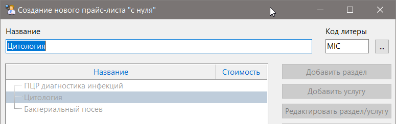

<u>**Обратите внимание:**</u> таким образом можно "отредактировать" название только что добавленного раздела, которого еще нет в базе данных. В противном случае вы получите отказ

 

Если изменить код литеры, то у вас появиться ***новый*** раздел, а старый  - останется. 

Для более полной иллюстрации возможностей добавим в наш прайс-лист еще несколько разделов и выделим один из них

##### *Добавление/редактирование медицинских услуг прайс-листа*

Чтобы добавить в выделенный раздел медицинскую услугу, нажмем кнопку `Добавить услугу` ("горячая клавиша" `Shift+Ctrl+2`). Откроется панель редактирования для добавления новой услуги текущего прайса


Цифрами обозначены:
1. ***Название*** - наименование новой медицинской услуги
2. ***Стоимость*** - стоимость медицинской услуги на момент создания прайса (стоимость услуги можно указать позже)
3. кнопка `...` ("горячая клавиша" `Shift+Ctrl+6`) для быстрого добавления услуги путем выбора из [списка услуг базового прайса](#47_mnu_price_list).

	

	<u>**Обратите внимание:**</u> во всплывающем окне выбора услуги будет отображаться список медицинских услуг, которые "принадлежат" тому разделу базового прайса, в который мы эти услуги добавляем (в приведенном примере, это раздел "Цитология")
	
После сохранения введенной/выбранной услуги она отобразится в общем списке


Отредактировать данную услугу можно, нажав на кнопку `Редактировать раздел/услугу` ("горячая клавиша" `Shift+Ctrl+3`). Откроется та же панель редактирования


Вот тут кроется некоторый нюанс: если вы измените название услуги и сохраните изменения, то в базу будет добавлена новая услуга, а прежняя "скроется".

  

А вот если вы захотите переименовать эту услугу в первоначальный вариант (который был выбран из уже имеющихся в базе данных), то вам в этом будет отказано.


Честно говоря, я уже сам не помню, почему я так сделал. Но так было надо! :stuck_out_tongue_winking_eye:

Добавим и отредактируем подобным образом медицинские услуги для остальных разделов, чтобы получилась примерно такая картина


Затем сохраним наш прайс-лист. В результате мы получим вот такой результат. 


<u>**Обратите внимание:**</u> в списке прайсов у нас отображается пока только один пункт, зато стали доступны кнопки добавления(из уже имеющегося прайса)/редактирования/удаления текущего прайс листа. Также мы можем фильтровать список по разделам базового прайса

#### Создание нового прайс-листа из текущего <a name="452_mnu_price_create_exists"></a>


Это действие позволяет создать новый прайс путем копирования содержимого одного из уже имеющихся прайсов-листов. Это бывает удобно, когда изменились цены некоторых услуг, но сам набор услуг остался прежним. Вызывается при нажатии на кнопку `+` ("горячая клавиша" `Shift+Ctrl+2`). Будет вызвана следующая форма 


Цифрами обозначены следующие важные моменты:
1. группа чекбоксов
	- *"Обнулить" стоимость всех услуг* - сбрасывает к нулевым стоимость услуг в создаваемом прайс листе. Удобно, когда проще ввести новые цены "с нуля", чем отслеживать, какие из них "старые", а какие - "новые".
	
		
	
	- Подсвечивать измененные разделы и услуги - позволяет визуально отслеживать позиции прайса, которые вы изменили или добавили
	
		
	
		Это справедливо и в отношении вновь добавленных медицинских услуг
	
		
		
	- *Скрывать удаленные разделы и услуги* - позволяет скрыть  разделы  и отдельные услуги, которые вы сочли "лишними" в создаваемом прайс-листе. Визуально облегчает восприятие информации, особенно при большом количестве позиций
	
		
		
2. ***Название нового прайс-листа*** - вводится имя нового прайс-листа
3. группа кнопок для добавления/редактирования/удаления разделов и медицинских услуг. 

	<u>**Обратите внимание:**</u> В этом режиме создания прайса разделы базового прайса можно добавлять и удалять, но нельзя редактировать. Также кнопки удаления/восстановления медицинских услуг будут доступны соответственно состоянию элемента списка
	
		
	
Ну и наконец, после нажатия кнопки `Сохранить` получаем новый прайс-лист, созданный на основе предыдущего


#### Редактирование текущего прайса <a name="453_mnu_price_create_edit"></a>


Это действие позволяет отредактировать текущий прайс-лист. Вызывается при нажатии на кнопку `...` ("горячая клавиша" `Shift+Ctrl+3`). Будет вызвана уже знакомая по выше описанным разделам форма 


Единственным отличием будет невозможность отредактировать имя текущего прайса (указано стрелкой на скрине выше). Остальные действия по модификации прайс-листа производятся аналогично описанным в предыдущих двух разделах

#### Удаление текущего прайса <a name="454_mnu_price_create_delete"></a>


Это действие позволяет удалить текущий прайс-лист. Вызывается при нажатии на кнопку `-` ("горячая клавиша" `Shift+Ctrl+4`). Появится диалоговое окно с подтверждением ваших намерений для исключения случайного действия


В случае вашего согласия текущий прайс-лист будет удален.

[Вернуться к оглавлению](#page_toc)

---

### Разделы базового прайса <a name="46_mnu_price_depart"></a>

Действие позволяет добавлять/редактировать список разделов базового прайса. Разделы фактически представляют из себя названия групп медицинских услуг (различные виды лабораторных и инструментальных исследований, манипуляций и проч.). Вызвать его можно несколькими способами: либо из соответствующего пункта меню
 


либо при помощи "горячих клавиш" `Shift+Ctrl+R` 

После вызова действия появится окно с имеющимся в БД списком разделов базового прайса (если БД "пуста", вы увидите соответствующее предупреждение)


Чтобы добавить новый раздел, необходимо нажать на кнопку с `+` (на скрине выше указана стрелкой). Откроется панель редактирования


Цифрами обозначены поля:
1. ***Литера кода*** - уникальное сочетание символов, на основании которых будут автоматически генерироваться коды для создаваемых услуг в прайсе. Вводятся только латинские символы.
2. ***Наименование корневого раздела прайса*** - собственно, название раздела 

После нажатия кнопки `Сохранить` данные ЛПУ будут внесены в базу данных.


<u>**Обратите внимание:**</u> при наличии хотя бы одной записи в списке становятся доступными кнопки редактирования  `...` ("горячая клавиша" `Ctrl+E`) и удаления `x` ("горячая клавиша" `Ctrl+D`) записи.

[Вернуться к оглавлению](#page_toc)

---

### Список услуг базового прайса <a name="47_mnu_price_list"></a>

Действие позволяет добавлять/редактировать список медицинских услуг базового прайса. Каждая медицинская услуга должна "принадлежать" одному из [разделов базового прайса](#46_mnu_price_depart). Вызвать список услуг можно несколькими способами: либо из соответствующего пункта меню
 


либо при помощи "горячих клавиш" `Shift+Alt+R` 

После вызова действия появится окно с имеющимся в БД списком разделов базового прайса (если БД "пуста", вы увидите в списке соответствующее предупреждение) 


Чтобы добавить новую услугу, необходимо нажать на кнопку с `+` (на скрине выше указана стрелкой). Откроется панель редактирования


Цифрами обозначены поля:
1. ***Раздел прайса*** - выпадающий список с разделами, к которому будет "принадлежать" вводимая медицинская услуга. Если список до сих пор пуст, то появится соответствующее предупреждение. Добавить туда значения можно, нажав на кнопку с тремя точками (указано стрелкой) справа от списка (подробнее этот процесс описан в [этом разделе](#46_mnu_price_depart)) 

	Если попытаться сохранить данные с "пустым" списком разделов, получим ожидаемый отказ
	
	

2. ***Код услуги*** - поле-идентификатор медицинской услуги. Должно иметь уникальное значение в пределах одной базы. Если вам все равно, какое там будет значение, можно оставить это на усмотрение программы, которое заполнит его автоматически

3. ***Наименование услуг*** - поле, содержащее название мединской услуги. Является обязательным к заполнению и должно иметь уникальное значение в пределах одной базы

4. группа кнопок `+` `-` - позволяет добавлять/удалять поля ввода сразу нескольких медицинских услуг, чтобы упростить рутину данного процесса. Обратите внимание, что для каждой медицинской услуги можно выбрать "свой" раздел прайса

	
	
После ввода значений 


и нажатия кнопки `Сохранить` введенные значения отобразятся в итоговом списке


<u>**Обратите внимание:**</u> при наличии хотя бы одной записи в списке становятся доступными кнопки редактирования  `...` ("горячая клавиша" `Ctrl+E`) и удаления `x` ("горячая клавиша" `Ctrl+D`) записи.

<u>**Обратите внимание:**</u> если медицинская услуга была уже включена хотя бы в один прайс-лист, то вам будет отказано в ее удалении

[Вернуться к оглавлению](#page_toc)

---

### Справочник лекарств <a name="48_mnu_drug_list"></a>

Действие позволяет добавлять/редактировать данные о лекарственных препаратах, применяемых в процессе лечения, а также печатать рецепты  на препараты и инструкции по применению лекарственных средств (ЛС). Вызвать его можно несколькими способами:
- из соответствующего пункта меню


- из панели инструментов 


- при помощи "горячей клавиши" `Ctrl+G` 

После вызова действия появится соответствующее окно


где цифрами обозначены следующие моменты:
1. ***Врач, назначающий препараты*** - выпадающий список, где указан данные врача, чья фамилия будет отображена на бланке рецепта. Если в базе пока нет данных хотя бы одного врача, в списке будет отображаться предупреждающая надпись. Чтобы добавить/отредактировать данные врача, нажмите на кнопку `...` справа от выпадающего списка (указано стрелкой), откроется соответствующее окно (подробнее работа с ним описана [здесь](#42_mnu_medical)).
2. список лекарственных препаратов, внесенных в базу данных. Если таких сведений нет, появится соответствующая надпись.
3. кнопка `+` для добавления данных о новом препарате.

После нажатия кнопки `+` появится панель редактирования


где цифрами обозначены следующие моменты
1. ***Наименование препарата*** - коммерческое название препарата на русском/латинском языке, можно в скобках указать международное непатентованное название препарата/действующего вещества
2. ***Разовая доза*** - как правило, указывается доза препарата на один прием
3. ***Кратность приема*** - указывается периодичность приема препарата
4. ***Длительность применения*** - указывается длительность курса приема
5. ***Способ введения*** - выпадающий список, где можно выбрать необходимое значение. Если нужного вам значения не нашлось, можно подобрать похожее, а [отредактировать позже](#3861_mnu_patient_visit_treatment_treat)

	
	
6. ***Время приема*** - выпадающий список, где можно выбрать необходимое значение. Если нужного вам значения не нашлось, можно подобрать похожее, а [отредактировать позже](#3861_mnu_patient_visit_treatment_treat)

	
	
7. ***Сведения о препарате*** - сюда вы можете поместить аннотацию к препарату, взятую из достоверных источников. Ее можно будет распечатать для пациента, нажав на кнопку `Аннотация`, расположенной в основной форме справочника ниже списка препаратов (описано далее). Текст аннотации можно отредактировать и отформатировать в отдельном окне простейшего [редактора текста](#8_mnu_db_editor), нажав на кнопку `Формат`(указана стрелкой) справа от поля ввода

8. ***Рецептурная пропись*** - здесь указывается текст рецепта, как он будет выглядеть внутри рецепторного бланка при печати. Ответственность за "правильность" текста целиком лежит на вас. Текст рецепта можно отредактировать и отформатировать в отдельном окне простейшего [редактора текста](#8_mnu_db_editor), нажав на кнопку `Формат`(указана стрелкой) справа от поля ввода

После нажатия кнопки `Сохранить` введенные нами данные препарата появляются в общем списке препаратов.


<u>**Обратите внимание:**</u> при наличии хотя бы одной записи в списке становятся доступными кнопки редактирования  `...` ("горячая клавиша" `Ctrl+E`) и удаления `x` ("горячая клавиша" `Ctrl+D`) записи.

Также обратите внимание, что при наличии хотя бы одной записи в списке становятся доступными дополнительные кнопки:

1. ***Рецепт*** - кнопка позволяет вывести на печать рецепт выделенного в списке препарата
	> По умолчанию шаблоны рецептов находятся в папке "Reports", которая находится рядом с исполняемым файлом программы "АРМ врача" от Leybasoft™ версия 4. Если какого-то шаблона программа вдруг не нашла, то будет выведено соответствующее предупреждение с предложением найти его самостоятельно

		
	
	> Если если вы случайно удалили требуемый шаблон, его всегда можно "достать" из архива программы соответствующей вашей версии [отсюда](https://github.com/zoltanleo/ARM_doc_v4/releases) 

	Откроется документ печати рецепта в режиме предосмотра
	
	
	
	
	
	Назначение большинства кнопок очевидно и не требует пояснений. Хотелось отметить, что отчет можно выводить на печать не сразу, а экспортировать в некоторые форматы (ODT/RTF/HTML/PDF), где их можно отредактировать при необходимости
	
	<u>**Обратите внимание:**</u> если вы не заполнили поле ввода "Рецептурная пропись" для препарата, то на печать будет выведен либо пустой бланк рецепта, либо тот текст, который указан в этом поле по умолчанию
	
	
	
2. ***Аннотация*** - позволяет вывести на печать содержимое поля "Сведения о препарате" для данного лекарственного средства
3. ***формат А4/А5*** - задается формат печатного листа А4/А5
4. ***форма рецепта*** - указывается одна из форм рецептурных бланков (рецептурная форма для выписки наркотических средств исключена) для печати

	
	
	Форму `№148-1/у-88` можно распечатать в "портретной" или "альбомной" ориентации, так как из-за большого количества размещенной информации на бланке текст рецепта может просто не поместиться
	

[Вернуться к оглавлению](#page_toc)

---

### Справочник диагнозов <a name="49_mnu_ds_list"></a>

Действие позволяет добавлять/редактировать данные об используемых диагнозах. Вызвать справочник можно несколькими способами:
- из соответствующего пункта меню


- из панели инструментов 


- при помощи "горячей клавиши" `Ctrl+H` 

После вызова действия появится соответствующее окно


Если список с диагнозами пуст, появится соответствующая надпись. Чтобы добавить диагноз в список, необходимо нажать на кнопку `+` (указана стрелкой) справа от списка. При ее нажатии откроется панель редактирования


где цифрами указаны следующие моменты:
1. ***Код по МКБ-Х*** - код нозологической единицы согласно официально принятой классификации
2. ***Диагноз*** - название нозологической единицы, которую вы будете использовать в работе
3. кнопка `...` для быстрого выбора "нужного" диагноза из справочника МКБ-10

	

	Вы можете править вставленный из справочника диагноз по своему усмотрению
	
После нажатия кнопки `Сохранить` введенный нами диагноз появится в общем списке


<u>**Обратите внимание:**</u> при наличии хотя бы одной записи в списке становятся доступными кнопки редактирования  `...` ("горячая клавиша" `Ctrl+E`) и удаления `x` ("горячая клавиша" `Ctrl+D`) записи.

[Вернуться к оглавлению](#page_toc)

---

### Список манипуляций <a name="410_mnu_manip_list"></a>

Действие позволяет добавлять/редактировать данные о назначаемых манипуляциях. Вызвать справочник можно несколькими способами:
- из соответствующего пункта меню


- из панели инструментов 


- при помощи "горячей клавиши" `Ctrl+J` 

После вызова действия появится соответствующее окно


Если список с манипуляциями пуст, появится соответствующая надпись. Чтобы добавить манипуляцию в список, необходимо нажать на кнопку `+` (указана стрелкой) справа от списка. При ее нажатии откроется панель редактирования


Назначение полей ввода очевидно и не требует пояснений. После нажатия кнопки `Сохранить` добавленная манипуляция отобразится в общем списке


<u>**Обратите внимание:**</u> при наличии хотя бы одной записи в списке становятся доступными кнопки редактирования  `...` ("горячая клавиша" `Ctrl+E`) и удаления `x` ("горячая клавиша" `Ctrl+D`) записи.

[Вернуться к оглавлению](#page_toc)

---

### Список рекомендаций <a name="411_mnu_recom_list"></a>

Действие позволяет добавлять/редактировать данные даваемых пациентам рекомендаций. Вызвать справочник можно несколькими способами:
- из соответствующего пункта меню


- из панели инструментов 


- при помощи "горячей клавиши" `Ctrl+K` 

После вызова действия появится соответствующее окно


Если список с рекомендациями пуст, появится соответствующая надпись. Чтобы добавить рекомендацию в список, необходимо нажать на кнопку `+` (указана стрелкой) справа от списка. При ее нажатии откроется панель редактирования


Назначение поля ввода очевидно и не требует пояснений. После нажатия кнопки `Сохранить` добавленная манипуляция отобразится в общем списке


<u>**Обратите внимание:**</u> при наличии хотя бы одной записи в списке становятся доступными кнопки редактирования  `...` ("горячая клавиша" `Ctrl+E`) и удаления `x` ("горячая клавиша" `Ctrl+D`) записи.

[Вернуться к оглавлению](#page_toc)

---

## 5. Меню "Отчеты" <a name="5_mnu_db_report"></a>

Действия, описанные в этом разделе, позволяют увидеть результаты ваших письменных усилий и вывести их на печать. 

### Общий осмотр <a name="51_mnu_db_report_exam"></a>

Здесь отображается группа отчетов, позволяющая вывести на печать результаты приема пациента у врачей. Соответственно, доступны для вызова они будут только при открытии списка [визитов к врачу](#34_mnu_patient_visit_list) конкретного пациента, если они у него были. 


В общем случае предосмотр отчета выглядит примерно так  


В верхнем углу расположены кнопки управления отчетом <a name="510_mnu_db_report_preview"></a>


где цифрами обозначены следующие моменты:

1. ***Печать*** - вызывается стандартный диалог печати документа
2. ***Сохранить*** - позволяет экспортировать отчет в документы формата `ODT`/`RTF`/`HTML`/`PDF`

	

3. ***Сохранить в PDF*** - экспортирует отчет в документ формата `PDF`. Дублирует один из пунктов предыдущего подменю
4. ***Масштаб*** - позволяет масштабировать изображение отчета
5. ***Во весь экран*** - переключает отображение в полноэкранный режим (без рамок окон)
6. ***Свойства страницы*** - можно задать параметры формата страниц(ы) по определенным критериям
7. Навигация по страницам - позволяет переходить к определенным страницам (актуально при многостраничных отчетах)
8. ***Закрыть*** - кнопка закрытия предосмотра отчета ("горячая клавиша" `Esc`)

[Вернуться к оглавлению](#page_toc)

---

#### Общий осмотр(формат А5) полный <a name="511_mnu_db_report_exam_only_a5"></a>

Действие позволяет отображать данные приема, которые включают в себя все данные (жалобы, анамнез, физикальный осмотр, диагноз, лечение и рекомендации), за исключением результатов исследований.

Отчет скомпонован на страницах формата А5, "горячие клавиши" `Shift+Ctrl+F`


[Вернуться к оглавлению](#page_toc)

---

#### Общий осмотр(формат А5) краткий <a name="512_mnu_db_report_exam_short_a5"></a>

Действие позволяет отображать только диагноз, лечение и рекомендации. Часто это основной вид отчета, который выдается пациенту на руки.

Отчет скомпонован на страницах формата А5, "горячие клавиши" `Shift+Ctrl+W`


[Вернуться к оглавлению](#page_toc)

---

#### Общий осмотр(формат А5) с анализами <a name="513_mnu_db_report_exam_full_a5"></a>

Действие позволяет отображать полные данные визита со всеми исследованиями. Особенно удобно использовать, чтобы "освежить" в памяти данные предыдущих визитов.

Отчет скомпонован на страницах формата А5, "горячие клавиши" `Shift+Ctrl+E`


[Вернуться к оглавлению](#page_toc)

---

#### Общий осмотр(формат А4) полный <a name="514_mnu_db_report_exam_only_a4"></a>

Действие позволяет отображать данные приема, которые включают в себя все данные (жалобы, анамнез, физикальный осмотр, диагноз, лечение и рекомендации), за исключением результатов исследований.

Отчет скомпонован на страницах формата А4, "горячие клавиши" `Shift+Alt+F`


[Вернуться к оглавлению](#page_toc)

---

#### Общий осмотр(формат А4) краткий <a name="515_mnu_db_report_exam_short_a4"></a>

Действие позволяет отображать только диагноз, лечение и рекомендации. Часто это основной вид отчета, который выдается пациенту на руки.

Отчет скомпонован на страницах формата А4, "горячие клавиши" `Shift+Alt+W`


[Вернуться к оглавлению](#page_toc)

---

#### Общий осмотр(формат А4) с анализами <a name="516_mnu_db_report_exam_full_a4"></a>

Действие позволяет отображать полные данные визита со всеми исследованиями. Особенно удобно использовать, чтобы "освежить" в памяти данные предыдущих визитов.

Отчет скомпонован на страницах формата А5, "горячие клавиши" `Shift+Alt+E`


[Вернуться к оглавлению](#page_toc)

---

### Фото с приема <a name="52_mnu_db_report_photos"></a>

... раздел в процессе разработки ...

[Вернуться к оглавлению](#page_toc)

---

### Ультразвуковые исследования <a name="53_mnu_db_report_US"></a>

Действие позволяет отображать и выводить на печать протоколы УЗ-исследований пациента. Действие доступно для вызова только при открытии списка [визитов к врачу](#34_mnu_patient_visit_list) конкретного пациента, если они у него были. 

Вызывается из пункта меню или при помощи "горячей клавиши" `Shift+Ctrl+O`


После вызова действия появится окно, отображающее все проведенные пациенту УЗ-исследования. Если таковых у пациента нет, будет отображено соответствующее предупреждение


Найденные у пациента УЗ-исследования будут отображены следующим образом


где цифрами обозначены следующие моменты:
1. список исследований, отсортированный по датам в порядке убывания. Также в списке указано какие исследования проводились пациенту на эту дату
2. ***Виды исследований*** - группа чекбоксов, отметив которые, можно вывести протокол исследования на печать. Обратите внимание, что вам будет отказано в печати, если вы не отметите ни один из чекбоксов

	

3. ***кнопка "Печать"*** - позволяет вызвать окно предосмотра отчета (подробнее работа с ним описана [здесь](#510_mnu_db_report_preview))

4. ***список "формат А5/А4"*** - позволяет задать формат листа, на котором будет компоноваться выводимый отчет

	

Обратите внимание, что при навигации по списку доступность чекбоксов справа от него будет меняться в зависимости от того, проводилось это исследование на определенную дату или нет

 

Если чекбокс доступен, то, пометив его, можно вызвать печать протокола кнопкой `Печать` ("горячая клавиша" `Ctrl+P`). Также обратите внимание, что нельзя вывести на печать сразу два протокола одновременно


После нажатия кнопки `Печать` откроется окно предосмотра


работа с которым подробно описана описана [здесь](#510_mnu_db_report_preview).

[Вернуться к оглавлению](#page_toc)

---

### Бланк обследования на сифилис <a name="54_mnu_db_report_lues"></a>

Действие позволяет отображать и выводить на печать результаты осмотра пациента на сифилис на определенную дату. Действие доступно для вызова только при открытии списка [визитов к врачу](#34_mnu_patient_visit_list) конкретного пациента, если они у него были. 

Вызывается из пункта меню или при помощи "горячей клавиши" `Shift+Ctrl+H`


После вызова действие будет отображена форма бланка осмотра (прил.1 к приказу МЗ РФ №2 от 10.01.1995г) 


<u>**Обратите внимание:**</u> что здесь вы можете только распечатать ранее введенные результаты. Если вам необходимо изменить их, то сделать это можно только, [отредактировав данные визита](#3841_mnu_patient_visit_labor_common) на эту дату.

Цифрами обозначены следующие моменты:
1. ***кнопка "Печать"*** - позволяет вызвать окно предосмотра отчета (подробнее работа с ним описана [здесь](#510_mnu_db_report_preview))

2. ***список "формат А5/А4"*** - позволяет задать формат листа, на котором будет компоноваться выводимый отчет

	 
	
После нажатия кнопки `Печать` откроется окно предосмотра

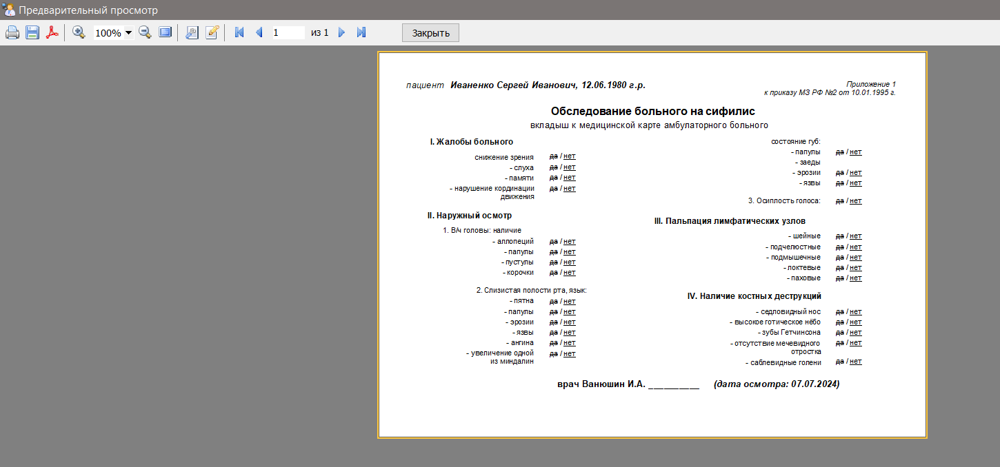

работа с которым подробно описана описана [здесь](#510_mnu_db_report_preview).

[Вернуться к оглавлению](#page_toc)

---

### Направления на исследования <a name="55_mnu_db_report_research"></a>

Действие позволяет формировать и выводить на печать назначаемые или оказываемые конкретному пациенту медицинские услуги. Вызывается из пункта меню или при помощи "горячей клавиши" `Shift+Ctrl+Y`


После вызова действия откроется окно


где цифрами обозначены следующие моменты:
1. ***Название прайс-листа*** - выпадающий список с прайс-листами, из одного из которых будут браться данные с соответствующими ценами на услуги. Прайс лист должен быть не пуст. Если вы хотите добавить новый или отредактировать текущий, нажмите на кнопку `...` справа от списка (указана стрелкой) или используйте "горячую клавишу" `Shift+Ctrl+1`

	
	
	Откроется форма редактирования, подробная работа с которой описана [здесь](#45_mnu_price)

2. ***Разделы прайса*** - список, который позволяет фильтровать отображение медицинских услуг по [разделам базового прайса](#46_mnu_price_depart)

	
	
3. ***Направляющая клиника*** - выпадающий список, где можно указать, какая клиника направляет пациента на получение медуслуг. Список должен быть не пуст. Если вы хотите добавить новое ЛПУ или отредактировать текущее, нажмите на кнопку `...` справа от списка (указана стрелкой) или используйте "горячую клавишу" `Shift+Ctrl+2`

	

	Откроется форма редактирования, подробная работа с которой описана [здесь](#43_mnu_hospital)
	
4. ***Направляющий врач*** - выпадающий список, где можно указать, какой врач направляет пациента на получение медуслуг. Список должен быть не пуст. Если вы хотите добавить нового врача или отредактировать данные текущего, нажмите на кнопку `...` справа от списка (указана стрелкой) или используйте "горячую клавишу" `Shift+Ctrl+3`

	

	Откроется форма редактирования, подробная работа с которой описана [здесь](#42_mnu_medical)
	
5. Список медицинских услуг, доступных для назначения пациенту
6. Кнопки переноса медицинских услуг из списка доступных (расположен слева) в список назначаемых пациенту услуг (расположен справа). Переносить выбранные элементы слева направо и наоборот можно  
	- при помощи кнопок `<`/`>` (перенос одной или нескольких выбранных записей) или "горячих клавиш" `Ctrl+Shift` + `стрелка влево`/`стрелка вправо`
	
		
		
	- при помощи кнопок `<<`/`>>` (перенос всех записей из одного списка в другой) или "горячих клавиш" `Ctrl+Shift+Alt` + `стрелка влево`/`стрелка вправо`
	
		
		
	- путем перетаскивания мышью	
		
		
		
		<u>**обратите внимание:**</u> сразу несколько записей можно отметить, если держать зажатой кнопку `Ctrl` и помечать записи левой кнопкой мыши
		
		<u>**обратите внимание:**</u> переключаться между списками можно при помощи "горячих клавиш" `Ctrl+Alt+Z` (активный список выделяется светло-голубым цветом)
		
				

7. Список медицинских услуг, назначаемых пациенту. Внизу списка имеется строка, где автоматически формируется итоговая сумма назначаемых услуг

	

При наличии хотя бы назначенной пациенту услуги (правый список) под ним становятся видны выпадающий список `формат А5/А4`(позволяет выбрать, на каком формате листа будет выведен отчет для печати) и кнопка `Печать` ("горячая клавиша" `Ctrl+P`). 


При нажатии на кнопку `Печать` откроется окно предосмотра


работа с которым подробно описана описана [здесь](#510_mnu_db_report_preview).

[Вернуться к оглавлению](#page_toc)

---

### Титульный лист амбулаторной карты <a name="56_mnu_db_report_titul"></a>

Действие позволяет выводить на печать титульный лист амбулаторной карты пациента. Вызывается из пункта меню или при помощи "горячей клавиши" `Shift+Ctrl+U`


После вызова действия откроется окно


где цифрами обозначены следующие моменты:
1. выпадающий список с ЛПУ, название которого будет указано в амбулаторной карте. Вы можете добавить или изменить данные клиники, нажав на кнопку `...` ("горячая клавиша" `Ctrl+I`) справа от списка (указана стрелкой). При этом откроется форма редактирования, подробная работа с которой описана [здесь](#43_mnu_hospital)

2. выпадающий список, позволяющий выбрать на каком формате бумаги будет выведен на печать отчет

3. кнопка `Печать` ("горячая клавиша" `Ctrl+P`)

При нажатии на кнопку `Печать` откроется окно предосмотра


работа с которым подробно описана описана [здесь](#510_mnu_db_report_preview).

[Вернуться к оглавлению](#page_toc)

---

### Расписание приема врача <a name="57_mnu_db_report_shedul"></a>

Действие позволяет выводить на печать список врачей с расписанием их приема в различных клиниках. Вызывается из пункта меню или при помощи "горячей клавиши" `Shift+Ctrl+I`


После вызова действия откроется окно с расписанием. Подробнее работа с окном описана в разделе [Справочники/Расписание приема врача](#44_mnu_shedul)


Цифрами обозначены следующие моменты:

1. ***кнопка "Печать"*** - позволяет выводить текущую запись на печать

2. ***выпадающий список форматов А5/А4*** - позволяет выбран формат листа, на котором будет выводится отчет.

После нажатия кнопки `Печать` ("горячая клавиша" `Ctrl+P`) откроется окно предосмотра


работа с которым подробно описана описана [здесь](#510_mnu_db_report_preview).

<u>**Обратите внимание:**</u> на скрине выше (выделено рамкой) отображен контактный номер телефона врача. "Видимость" этого номера в отчете можно изменить, отметив галочку "Для служебного использования" при внесении данных доктора в [справочнике врача](#42_mnu_medical) (цифра `2` на скрине). 

[Вернуться к оглавлению](#page_toc)

---

### Подготовка к исследованиям <a name="58_mnu_db_report_prepare"></a>

Действие позволяет формировать, сохранять и выводить на печать список рекомендаций для пациентов с полезной информацией о подготовке к исследованиям. Сами рекомендации хранятся во внешних файлах, а список хранит только ссылки на них. Вызывается из пункта меню или при помощи "горячей клавиши" `Shift+Ctrl+R`


После вызова меню появится форма, где в древовидном порядке должны будут отображаться исследования 


где цифрами обозначены следующие моменты:

1. древовидный список с рекомендациями, которые объединены логически в группы. В списке отображаются названия исследований и пути к файлам, где хранится информация о способах подготовки. Такой вариант позволяет использовать свои версии вариантов подготовки к исследованиям.

2. окно предосмотра содержимого файла, который выделен в данный момент в списке
3. ***Предосмотр файлов*** - чекбокс, который позволяет показывать/скрывать окно предосмотра

	
	
4. ряд настроек, которые управляют отображением окна предосмотра
5. группа кнопок, которая позволяет добавлять/редактировать/удалять элементы древовидного списка слева. Работа с ними описана ниже
6. группа контролов, которые позволяют выводить на печать отчет с содержимым выделенного в списке файла

Итак, если вы впервые вызвали окно с рекомендациями, оно откроется пустым


Чтобы его заполнить, необходимо добавить рекомендации. Поскольку рекомендации могут быть тематически похожими, логично объединить их по смыслу в группы. Это можно сделать, нажав на кнопку `Добавить группу` ("горячая клавиша" `Ctrl+N`)


В результате в списке появится название группы (в колонке "Путь к файлу" будет пусто).

Теперь добавим рекомендацию, нажав на кнопку `Добавить рекомендацию` ("горячая клавиша" `Shift+Ctrl+N`). Откроется окно 


где цифрами обозначены следующие моменты:

1. ***Название группы*** - выпадающий список с уже имеющимися в списке группами. По умолчанию указывается группа, которая была выделена в списке на момент добавления/редактирования рекомендации. При желании можно выбрать, чтобы добавляемая/редактируемая рекомендация не относилась ни к одной из групп

	
	
2. ***Название рекомендации*** - имя рекомендации, под которым она будет отображаться в общем списке

	
	
3. поле ввода, где будет отображаться содержимое открываемого файла (см. п.4)

	
	
	Ниже этого поля  видны настройки отображения текста, которые интуитивно понятны и не требуют пояснения
	
	

4. ***кнопка "Открыть файл"*** - вызывает ("горячая клавиша" `Ctrl+O`) диалог открытия файлов с расширениями `RTF`/`TXT`

	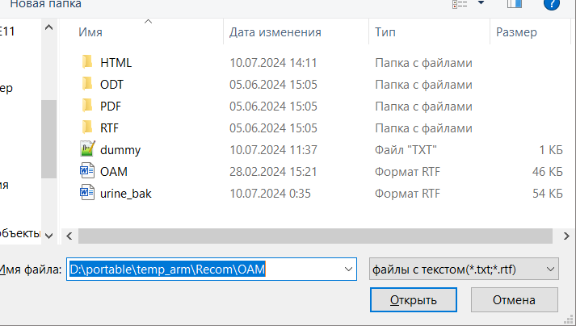

	 после успешного закрытия которого содержимое открытого файла отображается в поле ввода, описанного в п.3

5. ***кодировка текстового файла*** - выпадающий список, который позволяет задавать кодировку открываемого текстового файла (тот, у которого расширение обозначено как *.txt). 

	
	
	> Наиболее любознательные о кодировках текстов могут почитать [здесь](https://habr.com/ru/articles/478636/)
	
	Для чего нужен этот список? Например, если после открытия файла вы получаете вот такие "кракозябры"
	
	
	
	это означает, что программа не смогла самостоятельно правильно определить кодировку файла, поэтому вам нужно "угадать" ее самостоятельно. Вы можете либо подсмотреть кодировку в стороннем текстовом редакторе (например, в виндовом блокноте)
	
	
	
	либо начать перебирать "правильную" кодировку в этом списке (устанавливаете кодировку, потом заново открываете файл), пока не получите приемлемый результат
	
	

Таким образом весь процесс добавления рекомендации будет выглядеть примерно так


Результатом будет создания списка рекомендаций с указанием пути, в каких файлах хранятся эти рекомендации.


<u>**Обратите внимание:**</u> при наличии хотя бы одной записи в списке становятся доступными кнопки `Редактировать` ("горячая клавиша" `Ctrl+E`) и ` Удалить` ("горячая клавиша" `Ctrl+D`). 

Процесс редактирования разделов и рекомендаций аналогичен процессу их добавления.

Ниже списка с рекомендациями расположены
1. выпадающий список `формат А5/А4`, который позволяет задать формат бумаги, на котором будет сформирован отчет при выводе

2. кнопка `Печать` - показывает окно предосмотра отчета с содержимым файла с рекомендациями 

	
	
	работа с которым подробно описана описана [здесь](#510_mnu_db_report_preview).


[Вернуться к оглавлению](#page_toc)

---

## 6. Помощь <a name="6_mnu_db_help"></a>

### Справка<a name="61_mnu_db_helpfile"></a>

Действие позволяет получить справочную информацию по работе программы. Вызывается либо из пункта меню 


либо из панели инструментов


либо при помощи "горячей клавиши" `F1`

Справку можно получить либо из локального файла (находится в папке /help в каталоге с исполняемым файлом приложения), либо с online-ресурса. Препочтительный способ получения справки можно настроить по своему усмотрению (подробнее описано [здесь](#62_mnu_db_preferences)).

<u>**Обратите внимание:**</u> online-справка позволяет сразу открывать "нужный" раздел справки, например, из окна по нажатию кнопки `Помощь`. Локальная справка такой возможности лишена и "нужный" раздел вам придется открывать из оглавления.

Если вы пытаетесь открыть отсутствующий файл локальной справки, то будет выдано предупреждение с предложением открыть online-справку

   

Вот так выглядит online-справка в браузере


Вот так выглядит локальная справка в браузере


[Вернуться к оглавлению](#page_toc)

---

### Настройки <a name="62_mnu_db_preferences"></a>

Действие позволяет показать окно с настройками программы. Вызывается либо из пункта меню 


либо из панели инструментов


После вызова действия будет отображено окно с опциями приложения, структурироваными по группам в виде дерева слева. Выделются  следующие группы:

***Файл настроек*** - указывается местоположение файла с настройками программы (рядом с исполняемым файлом или в домашней папке вашей учетки на компьютере). Актуально для переносимой (портабельной) версии программы

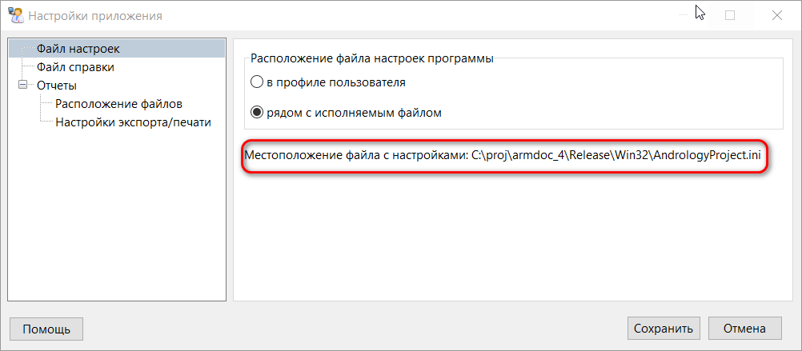

На скрине выделено текущее местоположение файла с настройками
	
***Файл справки*** - указывается, какая версия справки вызывается из программы по умолчанию. Более подробнее об этом написано [здесь](#61_mnu_db_helpfile)

	

***Отчеты*** - группа элементов списка, которы отвечают за следующие настройки
- ***Расположение файлов*** - здесь указывается папка с шаблонами отчетов, которые будет использовать программа в своей работе, а также пути вывода готовых файлов отчетов в разных форматов

	

- ***Настройки экспорта/печати*** - имеет два свойства

		
	
	- *Открывать документ после экспорта* - добавляет "галочку" по умолчанию во всех диалогах экспорта документа
	
		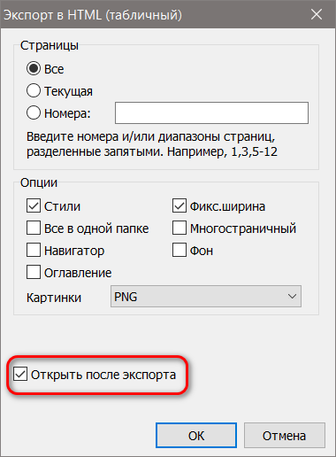
		
	- *Спрашивать при перезаписи документа* - открывает соответствующий диалог, если вы пытаетесь перезаписать файл отчета с аналогичным именем и расширением
	
		

[Вернуться к оглавлению](#page_toc)

---

### О программе <a name="63_mnu_db_about"></a>

Действие отображает стандартное окно "О программе" с информацией для пользователя


Внизу страницы размещены ссылки отправки email, открытия домашней страницы проекта и загрузки последнего релиза программы


[Вернуться к оглавлению](#page_toc)

---

## 7. Контекстные меню <a name="7_mnu_db_popup"></a>
### Меню общего списка пациентов <a name="71_mnu_db_popup_main"></a>

... раздел в процессе разработки ...

[Вернуться к оглавлению](#page_toc)

---

### Меню списка визитов пациента <a name="72_mnu_db_popup_detail"></a>

... раздел в процессе разработки ...

[Вернуться к оглавлению](#page_toc)

---

### Меню иконки приложения <a name="73_mnu_db_popup_tray"></a>

... раздел в процессе разработки ...

[Вернуться к оглавлению](#page_toc)

---

## 8. Окно редактора текста <a name="8_mnu_db_editor"></a>

Используется для простейших операций форматирования текста. Вызывается из различных мест программы


Функционал редактора очень похож на функционал редактора от ***M$ Word***, поэтому нет необходимости описывать назначения пунктов меню подробно. 

Единственный нюанс заключается в том, что вернуться из редактора обратно в поле редактирования можно <u>**с сохранением**</u> или <u>**без сохранения**</u> изменений в тексте. Для этого в редакторе имеются два действия:

- ***Выйти с сохранением ...*** - действие позволяет вернуться в поле редактирования, откуда был вызван редактор, <u>**с сохранением**</u> внесенных изменений. Действие можно вызвать либо из меню окна

	
	
	либо из панели инструментов
	
	
	
	либо при помощи "горячих клавиш" `Ctrl+S`
	
- ***Выйти без сохранения ...*** - действие позволяет вернуться в поле редактирования, откуда был вызван редактор, <u>**без сохранения**</u> внесенных изменений. Действие можно вызвать либо из меню окна

	
	
	либо из панели инструментов
	
	
	
	либо при помощи "горячих клавиш" `Esc`
	
	<u>***Обратите внимание:***</u> при закрытии окна таким образом появится предупреждение, позволяющее не потерять внесенные изменения
	
	
	
В целом процесс использования редактора выглядит примерно так


	

[Вернуться к оглавлению](#page_toc)

---

